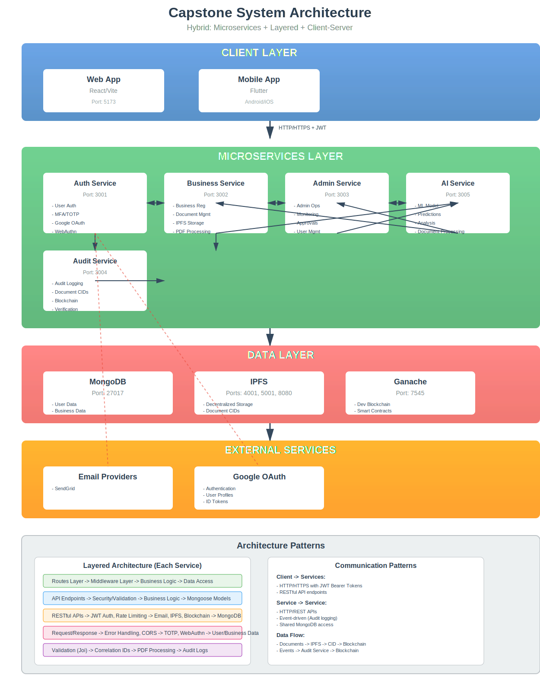
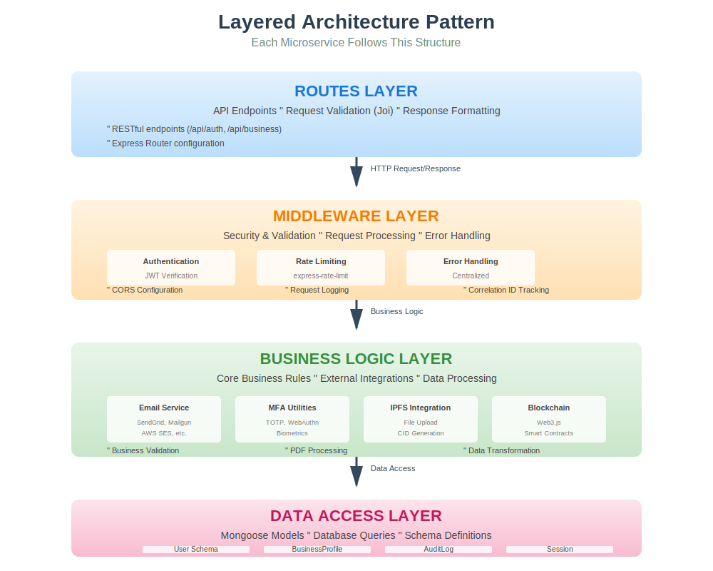

# 🏗️ System Architecture Diagram

## Overview
This Capstone project implements a **hybrid architecture** combining:
- **Microservices Architecture**: Independent backend services
- **Layered Architecture**: Each service organized in logical layers
- **Client-Server Architecture**: Traditional web/mobile clients with centralized backend

---

## 📊 High-Level Architecture



### Architecture Overview

The diagram above illustrates the complete system architecture with four main layers:

1. **Client Layer** (Blue) - Web, Mobile, and Admin interfaces
2. **Microservices Layer** (Green) - Four independent backend services
3. **Data Layer** (Red) - MongoDB, IPFS, and Blockchain storage
4. **External Services** (Orange) - Email providers, OAuth, and Docker

**Text-based view for reference:**

```
┌─────────────────────────────────────────────────────────────────────────────┐
│                            CLIENT LAYER                                     │
│  ┌─────────────────┐  ┌─────────────────┐  ┌─────────────────┐            │
│  │   Web App       │  │   Mobile App    │  │   Admin Web     │            │
│  │   (React/Vite)  │  │   (Flutter)     │  │   Interface      │            │
│  │   Port: 5173    │  │   Android/iOS   │  │                 │            │
│  └─────────────────┘  └─────────────────┘  └─────────────────┘            │
└─────────────────────────────────────────────────────────────────────────────┘
                                   │
                                   │ HTTP/HTTPS + JWT
                                   ▼
┌─────────────────────────────────────────────────────────────────────────────┐
│                          MICROSERVICES LAYER                               │
│                                                                             │
│  ┌─────────────────┐  ┌─────────────────┐  ┌─────────────────┐             │
│  │  Auth Service   │  │ Business Service│  │  Admin Service  │             │
│  │   Port: 3001    │◄─┼─► Port: 3002    │◄─┼─► Port: 3003    │             │
│  │                 │  │                 │  │                 │             │
│  │ • User Auth     │  │ • Business Reg  │  │ • Admin Ops     │             │
│  │ • MFA/TOTP      │  │ • Document Mgmt │  │ • Monitoring    │             │
│  │ • Google OAuth  │  │ • IPFS Storage  │  │ • Approvals     │             │
│  │ • WebAuthn      │  │                 │  │                 │             │
│  └─────────────────┘  └─────────────────┘  └─────────────────┘             │
│          │                   │                   │                         │
│          └───────────────────┼───────────────────┼─────────────────────────┘
│                              │                   │
│                              ▼                   ▼
│                     ┌─────────────────┐  ┌─────────────────┐                │
│                     │  Audit Service  │  │   Blockchain    │                │
│                     │   Port: 3004    │  │   Integration   │                │
│                     │                 │  │                 │                │
│                     │ • Audit Logging │  │ • Smart Contracts│                │
│                     │ • Document CIDs │  │ • User Registry  │                │
│                     │ • Blockchain    │  │ • Access Control │                │
│                     │ • Verification  │  │                 │                │
│                     └─────────────────┘  └─────────────────┘                │
└─────────────────────────────────────────────────────────────────────────────┘
                                   │
                                   │
┌─────────────────────────────────────────────────────────────────────────────┐
│                            DATA LAYER                                       │
│                                                                             │
│  ┌─────────────────┐  ┌─────────────────┐  ┌─────────────────┐             │
│  │    MongoDB      │  │      IPFS       │  │    Ganache      │             │
│  │   Port: 27017   │  │   Ports: 4001,  │  │  Port: 7545     │             │
│  │                 │  │      5001, 8080 │  │                 │             │
│  │ • User Data     │  │ • Decentralized │  │ • Dev Blockchain│             │
│  │ • Business Data │  │ • File Storage  │  │ • Smart Contracts│             │
│  │ • Audit Logs    │  │ • Document CIDs │  │ • Ethereum-like │             │
│  │ • Sessions      │  │ • Gateway       │  │                 │             │
│  └─────────────────┘  └─────────────────┘  └─────────────────┘             │
└─────────────────────────────────────────────────────────────────────────────┘
                                   │
                                   │
┌─────────────────────────────────────────────────────────────────────────────┐
│                         EXTERNAL SERVICES                                  │
│  ┌─────────────────┐  ┌─────────────────┐  ┌─────────────────┐             │
│  │ Email Providers │  │  Google OAuth   │  │   Docker        │             │
│  │ • SendGrid      │  │ • Authentication │  │ • Containerization│          │
│  │ • Mailgun       │  │ • User Profiles │  │ • Orchestration  │            │
│  │ • AWS SES       │  │ • ID Tokens     │  │                 │             │
│  │ • Resend        │  │                 │  │                 │             │
│  │ • Postmark      │  │                 │  │                 │             │
│  └─────────────────┘  └─────────────────┘  └─────────────────┘             │
└─────────────────────────────────────────────────────────────────────────────┘
```

---

## 🔧 Detailed Service Architecture

### Each Microservice Follows Layered Architecture:



**Text-based view for reference:**

```
┌─────────────────────────────────────────────────────────────┐
│                    SERVICE LAYER                            │
│  ┌─────────────────────────────────────────────────────────┐ │
│  │                    ROUTES LAYER                         │ │
│  │  ┌─────────────────────────────────────────────────────┐ │ │
│  │  │               API ENDPOINTS                         │ │ │
│  │  │  • RESTful endpoints (/api/auth, /api/business)    │ │ │
│  │  │  • Request validation (Joi)                        │ │ │
│  │  │  • Response formatting                             │ │ │
│  │  └─────────────────────────────────────────────────────┘ │ │
│  └─────────────────────────────────────────────────────────┘ │
│          │▲                                                   │
│          ││ HTTP Request/Response                            │
│          ▼│                                                   │
│  ┌─────────────────────────────────────────────────────────┐ │
│  │                 MIDDLEWARE LAYER                        │ │
│  │  ┌─────────────────────────────────────────────────────┐ │ │
│  │  │            SECURITY & VALIDATION                    │ │ │
│  │  │  • Authentication (JWT)                             │ │ │
│  │  │  • Rate Limiting                                     │ │ │
│  │  │  • CORS                                              │ │ │
│  │  │  • Error Handling                                    │ │ │
│  │  │  • Request Logging                                   │ │ │
│  │  │  • Correlation ID Tracking                           │ │ │
│  │  └─────────────────────────────────────────────────────┘ │ │
│  └─────────────────────────────────────────────────────────┘ │
│          │▲                                                   │
│          ││ Business Logic                                   │
│          ▼│                                                   │
│  ┌─────────────────────────────────────────────────────────┐ │
│  │                  BUSINESS LOGIC LAYER                   │ │
│  │  ┌─────────────────────────────────────────────────────┐ │ │
│  │  │                 LIB/HELPERS                          │ │ │
│  │  │  • Email Service (REST API calls)                   │ │ │
│  │  │  • TOTP/WebAuthn utilities                          │ │ │
│  │  │  • IPFS integration                                 │ │ │
│  │  │  • Blockchain/Web3.js integration                   │ │ │
│  │  │  • Business validation                              │ │ │
│  │  │  • PDF processing                                    │ │ │
│  │  └─────────────────────────────────────────────────────┘ │ │
│  └─────────────────────────────────────────────────────────┘ │
│          │▲                                                   │
│          ││ Data Access                                      │
│          ▼│                                                   │
│  ┌─────────────────────────────────────────────────────────┐ │
│  │                  DATA ACCESS LAYER                       │ │
│  │  ┌─────────────────────────────────────────────────────┐ │ │
│  │  │                MONGOOSE MODELS                       │ │ │
│  │  │  • User Schema                                       │ │ │
│  │  │  • BusinessProfile Schema                            │ │ │
│  │  │  • AuditLog Schema                                   │ │ │
│  │  │  • Session Schema                                    │ │ │
│  │  └─────────────────────────────────────────────────────┘ │ │
│  └─────────────────────────────────────────────────────────┘ │
└─────────────────────────────────────────────────────────────┘
```

---

## 🔄 Communication Patterns

### Inter-Service Communication:
```
Auth Service ↔ Business Service ↔ Admin Service ↔ Audit Service
      │              │              │              │
      └──────────────┼──────────────┼──────────────┘
                     │
                     ▼
               HTTP/REST APIs
               • Service-to-Service calls
               • Event-driven (Audit logging)
               • Shared MongoDB access
```

### Client-Service Communication:
```
Web/Mobile Clients
        │
        ▼ HTTP/HTTPS + JWT Bearer Tokens
API Gateway Pattern (Conceptual)
        │
        ▼ Load Balancing (Future)
Microservices Layer
```

### Data Flow Patterns:
```
1. Authentication Flow:
   Client → Auth Service → MongoDB
   Client → Auth Service → Google OAuth
   Client → Auth Service → MFA Validation

2. Business Registration Flow:
   Client → Business Service → IPFS (Document Storage)
   Client → Business Service → Audit Service → Blockchain

3. Audit Flow:
   Any Service → Audit Service → MongoDB
   Audit Service → Blockchain (Smart Contracts)

4. File Storage Flow:
   Client → Business Service → IPFS → CID Storage
   CID → Audit Service → Blockchain (Immutability)
```

---

## 🛡️ Security Architecture

```
┌─────────────────────────────────────────────────────────────────────┐
│                        SECURITY LAYERS                              │
│  ┌─────────────────────────────────────────────────────────────────┐ │
│  │                   CLIENT SECURITY                               │ │
│  │  • JWT Token Storage (Mobile: SharedPreferences)               │ │
│  │  • Secure HTTP Client with Bearer Token                        │ │
│  │  • Biometric Authentication (Fingerprint/FaceID)               │ │
│  └─────────────────────────────────────────────────────────────────┘ │
│  ┌─────────────────────────────────────────────────────────────────┐ │
│  │                   API SECURITY                                  │ │
│  │  • JWT Authentication Middleware                                │ │
│  │  • Rate Limiting (express-rate-limit)                          │ │
│  │  • CORS Configuration                                           │ │
│  │  • Input Validation (Joi)                                       │ │
│  │  • SQL Injection Prevention (Mongoose ODM)                      │ │
│  └─────────────────────────────────────────────────────────────────┘ │
│  ┌─────────────────────────────────────────────────────────────────┐ │
│  │                   MFA SECURITY                                  │ │
│  │  • TOTP (Time-based One-Time Password)                         │ │
│  │  • WebAuthn (Hardware Security Keys)                           │ │
│  │  • Biometric Authentication (Device-level)                     │ │
│  │  • Backup Codes (Recovery Mechanism)                           │ │
│  └─────────────────────────────────────────────────────────────────┘ │
│  ┌─────────────────────────────────────────────────────────────────┐ │
│  │                   BLOCKCHAIN SECURITY                           │ │
│  │  • Immutable Audit Trails                                      │ │
│  │  • Cryptographic Document Verification                         │ │
│  │  • Smart Contract Access Control                               │ │
│  │  • Decentralized Storage (IPFS)                                │ │
│  └─────────────────────────────────────────────────────────────────┘ │
└─────────────────────────────────────────────────────────────────────┘
```

---

## 📦 Deployment Architecture

```
┌─────────────────────────────────────────────────────────────────────┐
│                      DOCKER CONTAINERIZATION                        │
│  ┌─────────────────────────────────────────────────────────────────┐ │
│  │                   CONTAINER LAYER                               │ │
│  │  ┌─────┐ ┌─────┐ ┌─────┐ ┌─────┐ ┌─────┐ ┌─────┐ ┌─────┐        │ │
│  │  │Auth │ │Bus. │ │Admin│ │Audit│ │Mongo│ │IPFS │ │Gana.│        │ │
│  │  │Svc  │ │Svc  │ │Svc  │ │Svc  │ │DB   │ │Node │ │che  │        │ │
│  │  └─────┘ └─────┘ └─────┘ └─────┘ └─────┘ └─────┘ └─────┘        │ │
│  └─────────────────────────────────────────────────────────────────┘ │
│  ┌─────────────────────────────────────────────────────────────────┐ │
│  │                   ORCHESTRATION LAYER                           │ │
│  │  • Docker Compose (Development)                                │ │
│  │  • Kubernetes (Production)                                     │ │
│  │  • Service Discovery                                           │ │
│  │  • Load Balancing                                              │ │
│  └─────────────────────────────────────────────────────────────────┘ │
│  ┌─────────────────────────────────────────────────────────────────┐ │
│  │                   INFRASTRUCTURE LAYER                          │ │
│  │  • Cloud Providers (AWS/GCP/Azure)                             │ │
│  │  • Container Registries                                        │ │
│  │  • CI/CD Pipelines                                             │ │
│  │  • Monitoring & Logging                                        │ │
│  └─────────────────────────────────────────────────────────────────┘ │
└─────────────────────────────────────────────────────────────────────┘
```

---

## 🔄 Data Architecture

### Primary Data Stores:
```
┌─────────────────────────────────────────────────────────────────────┐
│                         DATA ARCHITECTURE                           │
│  ┌─────────────────────────────────────────────────────────────────┐ │
│  │                    RELATIONAL DATA                              │ │
│  │  • MongoDB Collections:                                        │ │
│  │    - users (authentication, profiles, MFA settings)            │ │
│  │    - business_profiles (business data, document metadata)      │ │
│  │    - audit_logs (audit events, blockchain hashes)              │ │
│  │    - sessions (user sessions, tokens)                          │ │
│  │    - login_requests/signup_requests (auth attempts)            │ │
│  └─────────────────────────────────────────────────────────────────┘ │
│  ┌─────────────────────────────────────────────────────────────────┐ │
│  │                    FILE STORAGE                                 │ │
│  │  • IPFS (InterPlanetary File System):                          │ │
│  │    - Business documents (PDFs, images)                         │ │
│  │    - User avatars                                              │ │
│  │    - Decentralized, content-addressed storage                  │ │
│  └─────────────────────────────────────────────────────────────────┘ │
│  ┌─────────────────────────────────────────────────────────────────┐ │
│  │                    BLOCKCHAIN STORAGE                           │ │
│  │  • Smart Contracts:                                            │ │
│  │    - AccessControl (role-based permissions)                    │ │
│  │    - UserRegistry (user verification)                          │ │
│  │    - DocumentStorage (document CIDs)                           │ │
│  │    - AuditLog (immutable audit trails)                         │ │
│  └─────────────────────────────────────────────────────────────────┘ │
└─────────────────────────────────────────────────────────────────────┘
```

---

## 🚀 Scalability & Performance

### Horizontal Scaling:
```
┌─────────────────────────────────────────────────────────────────────┐
│                      SCALING ARCHITECTURE                           │
│  ┌─────────────────────────────────────────────────────────────────┐ │
│  │                   SERVICE SCALING                               │ │
│  │  • Independent microservice scaling                           │ │
│  │  • Load balancer distribution                                  │ │
│  │  • Auto-scaling based on CPU/memory                            │ │
│  └─────────────────────────────────────────────────────────────────┘ │
│  ┌─────────────────────────────────────────────────────────────────┐ │
│  │                   DATA SCALING                                  │ │
│  │  • MongoDB sharding/clustering                                 │ │
│  │  • IPFS node clustering                                        │ │
│  │  • Blockchain network scaling                                  │ │
│  └─────────────────────────────────────────────────────────────────┘ │
│  ┌─────────────────────────────────────────────────────────────────┐ │
│  │                   CACHE LAYER                                   │ │
│  │  • Redis (future implementation)                               │ │
│  │  • CDN for static assets                                       │ │
│  │  • IPFS caching layer                                          │ │
│  └─────────────────────────────────────────────────────────────────┘ │
└─────────────────────────────────────────────────────────────────────┘
```

---

## 📋 Key Architectural Decisions

### Microservices Boundaries:
- **Auth Service**: Single responsibility for all authentication concerns
- **Business Service**: Dedicated to business registration and document workflows
- **Admin Service**: Isolated administrative functions and monitoring
- **Audit Service**: Centralized audit logging and blockchain integration

### Technology Choices:
- **Node.js/Express**: Consistent runtime across all services
- **MongoDB**: Flexible document storage for varying data models
- **IPFS**: Decentralized, permanent file storage
- **Blockchain**: Immutable audit trails and document verification
- **Docker**: Consistent deployment across environments

### Communication Patterns:
- **REST APIs**: Synchronous service-to-service communication
- **Shared Database**: Common data access pattern
- **Event-Driven**: Audit logging triggers blockchain operations

This hybrid architecture provides the scalability of microservices, the organization of layered architecture, and the simplicity of traditional client-server patterns while incorporating modern technologies like blockchain and decentralized storage.