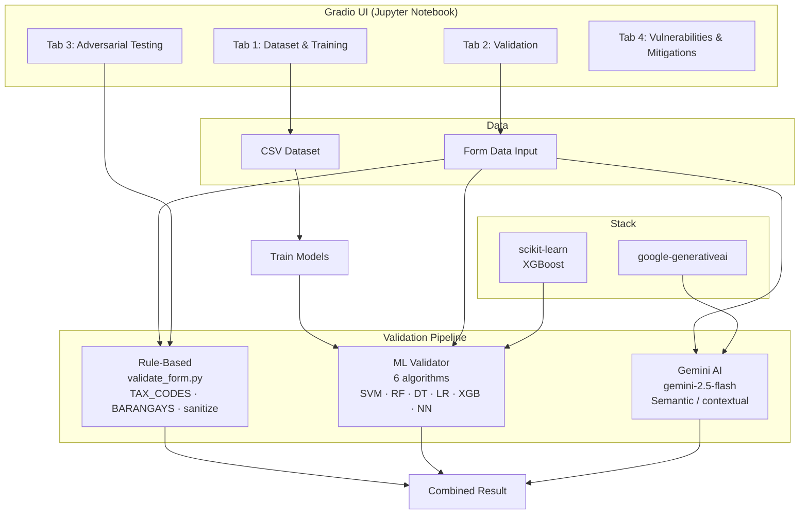
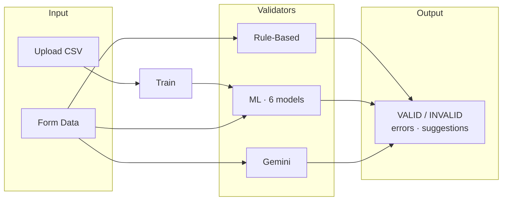

# BizClear: AI Document Validation Prototype for Alaminos City BPLO

## 1. Problem Statement

BPLO officers in Alaminos City must manually validate unified business permit applications. Manual review is error-prone, slow, and inconsistent across officers. Applicants often submit incomplete or incorrect data (missing fields, wrong tax codes, invalid addresses), leading to delays and repeated submissions.

## 2. Core Feature

An AI-powered form validation system that combines:
- **Traditional ML** (6 algorithms: SVM, RF, DT, LR, XGB, NN) for structured field validation
- **Gemini generative AI** for semantic/contextual validation (tax code matches line of business, lessor rules, etc.)
- **Rule-based validation** (`ai/validation/validate_form.py`) for deterministic checks with input sanitization
- **Embedded prototype UI** in a Jupyter notebook (Gradio) for demo and presentation

## 3. User Story and Acceptance Criteria

As a BPLO officer, I want to upload a dataset, train the models, then validate business permit form data and receive immediate feedback so that I can catch errors before manual review.

**Acceptance criteria:**
- Officer can upload a CSV dataset, train 6 ML models, and view accuracy metrics
- Officer can input form data via Gradio (tax code + line of business cascading dropdowns, barangay dropdown, seed buttons)
- System returns triple validation: rule-based, ML model, and Gemini AI
- System flags missing required fields, invalid tax codes, invalid addresses, tax code / line of business mismatch
- System provides human-readable suggestions for corrections
- Prototype runs in notebook with embedded Gradio UI (no separate web app)
- Adversarial testing tab to verify security (prompt injection, invalid inputs, etc.)

## 4. Simple Diagram

```
[Upload CSV] → [Train Models] → [Form Data] → [Rule-Based] → [Combined Result]
                     ↓              ↓              ↓
                ML Validator   Gemini Validator   Field-by-field status
```

## 4.1 Architecture Diagram





## 5. Tools/APIs

- **Python:** pandas, scikit-learn, XGBoost, matplotlib, seaborn
- **Gemini:** google-generativeai (Gemini 2.5 Flash)
- **UI:** Gradio (embedded in Jupyter notebook) — 4 tabs: Dataset & Training, Validation, Adversarial Testing, Vulnerabilities & Mitigations
- **Environment:** Jupyter, local Python, GitHub Codespaces
- **Validation module:** `ai/validation/validate_form.py` (reusable rule-based logic, TAX_CODES, BARANGAYS, sanitization)

## 6. Test Plan

- **Unit tests:** `pytest ai/tests/` — preprocessing, model accuracy, `validate_form`
- **Happy Path:** Valid form submitted → System returns VALID, no errors
- **Edge Case:** Missing owner name → System returns INVALID with specific error
- **Edge Case:** Wrong tax code (e.g., 'Z') → System returns INVALID
- **Edge Case:** Tax code / line of business mismatch (e.g., G + Mining) → System returns INVALID
- **Adversarial:** Prompt injection, HTML injection, missing pre-requirements → System catches or sanitizes
- **Performance:** Validation completes within 5 seconds (ML) or 10 seconds (with Gemini)

## 7. Risks & Mitigations

- **Risk 1:** Gemini API rate limit or downtime
  - **Mitigation:** ML-only path works offline; rate limiting (10 calls/min) in notebook; fallback to rule-based + ML
- **Risk 2:** Synthetic dataset not representative of real applications
  - **Mitigation:** BPLO officer validates gold set (30–50 entries) during next visit; request official tax codes and line of business list from BPLO
- **Risk 3:** Prompt injection or malicious input
  - **Mitigation:** Structured Gemini prompt with anti-injection constraints; input sanitization (HTML stripping, length limits); treat all field values as data, never as commands

## 8. Roles & Timeline

- **Data:** Synthetic dataset generation (`ai/scripts/generate_unified_form_dataset.py`), BPLO validation
- **ML:** 6-algorithm pipeline with curated feature set (drops high-cardinality noise columns); model selection
- **Integration:** Gemini structured prompts (Role/Context/Task/Output/Constraints/Examples), combined approach
- **Demo:** Notebook with embedded Gradio UI (4-tab dashboard)

**Timeline:** Phase 1A (presentation materials).
