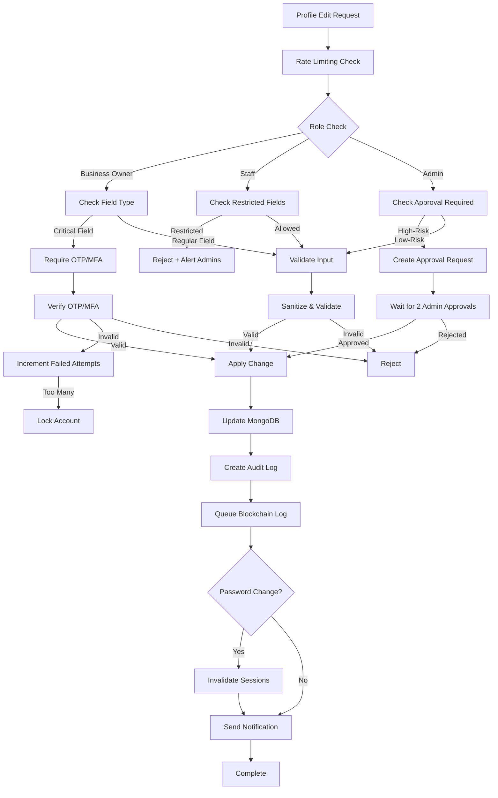

# Profile Edit Actions Implementation - Complete Plan

## Overview

Implement comprehensive profile editing system with role-based permissions, OTP/MFA verification for critical changes, admin approval workflows, session invalidation, blockchain audit logging, and industry-standard security practices.

## Architecture



## Implementation Steps

### 1. Session Invalidation System

**Files to modify:**
- `backend/src/models/User.js` - Add `tokenVersion` field
- `backend/src/middleware/auth.js` - Add token version validation
- `backend/src/lib/authRequestsStore.js` - Add session invalidation tracking (if needed)

**Implementation:**
- Add `tokenVersion: { type: Number, default: 0 }` to User schema
- Include `tokenVersion` in JWT payload when signing tokens
- Validate `tokenVersion` in `requireJwt` middleware
- Increment `tokenVersion` on password change to invalidate all sessions

### 2. OTP/MFA Verification Service

**Files to create:**
- `backend/src/lib/verificationService.js` - Unified verification service for OTP/MFA
  - `requestVerification(userId, method)` - Request OTP or MFA verification
  - `verifyCode(userId, code, method)` - Verify OTP or MFA code
  - Support both OTP (email) and MFA (TOTP/authenticator)
  - Track failed attempts and lock account if needed

**Files to modify:**
- `backend/src/routes/auth/profile.js` - Add verification middleware for critical changes

**Security:**
- Rate limit verification requests (5 attempts per 15 minutes)
- Account lockout after 5 failed attempts (15-minute lockout)
- Clear failed attempts on successful verification

### 3. Password Strength Validation

**Files to create:**
- `backend/src/lib/passwordValidator.js` - Password strength validation
  - `validatePasswordStrength(password)` - Check password meets requirements
  - Requirements: 8+ chars, uppercase, lowercase, number, special char
  - Return detailed validation errors

**Files to modify:**
- `backend/src/routes/auth/profile.js` - Add password validation to password change endpoints
- `backend/src/middleware/validation.js` - Add password validation schema

**Password History:**
- `backend/src/models/User.js` - Add `passwordHistory` array (store last 5 hashes)
- Prevent reusing last 5 passwords
- Clear history on password change

### 4. Rate Limiting

**Files to modify:**
- `backend/src/middleware/rateLimit.js` - Add new rate limiters
- `backend/src/routes/auth/profile.js` - Apply rate limits to all endpoints

**Rate Limits:**
- Verification requests: 5 per 15 minutes per user
- Profile updates: 10 per minute per user
- Password changes: 3 per hour per user
- ID uploads: 5 per hour per user
- Admin approval requests: 10 per hour per admin

### 5. Account Lockout System

**Files to modify:**
- `backend/src/models/User.js` - Add lockout fields
  - `failedVerificationAttempts: { type: Number, default: 0 }`
  - `accountLockedUntil: { type: Date, default: null }`
  - `lastFailedAttemptAt: { type: Date, default: null }`

**Files to create:**
- `backend/src/lib/accountLockout.js` - Account lockout logic
  - `checkLockout(userId)` - Check if account is locked
  - `incrementFailedAttempts(userId)` - Increment and lock if needed
  - `clearFailedAttempts(userId)` - Clear on successful verification
  - `unlockAccount(userId)` - Admin unlock function

**Implementation:**
- Lock account after 5 failed verification attempts
- 15-minute lockout period
- Auto-unlock after lockout period
- Admin can manually unlock accounts

### 6. Input Sanitization and Validation

**Files to create:**
- `backend/src/lib/sanitizer.js` - Input sanitization utilities
  - `sanitizeString(input)` - Remove XSS vectors
  - `sanitizeEmail(email)` - Email sanitization
  - `sanitizePhoneNumber(phone)` - Phone number sanitization

**Files to modify:**
- `backend/src/middleware/validation.js` - Enhanced validation schemas
  - Email format validation
  - Phone number format validation (country-specific)
  - ID number format validation
  - Name validation (no special chars, length limits)

**File Upload Validation:**
- `backend/src/lib/fileValidator.js` - File upload validation
  - `validateImageFile(file)` - Validate image files
  - Check file type (whitelist: jpg, png, pdf)
  - Check file size (max 5MB)
  - Verify file content (not just extension)
  - Future: Virus scanning integration

### 7. Business Owner Profile Edits

**Files to modify:**
- `backend/src/routes/auth/profile.js` - Add Business Owner specific endpoints

**New Endpoints:**
- `PATCH /api/auth/profile/email` - Change email (requires OTP/MFA, rate limited)
- `PATCH /api/auth/profile/password` - Change password (requires OTP/MFA, invalidates sessions, rate limited)
- `PATCH /api/auth/profile/name` - Update name/DOB (system verified)
- `PATCH /api/auth/profile/id` - Update ID type/number (requires OTP/MFA, rate limited)
- `POST /api/auth/profile/id-upload` - Upload ID front/back (requires OTP/MFA, file validation, rate limited)
- `PATCH /api/auth/profile/contact` - Update contact number (no verification, rate limited)
- `GET /api/auth/profile/audit-history` - View audit history

**Features:**
- Email change: OTP verification → MFA re-enrollment required → Grace period (24 hours to revert)
- Password change: OTP/MFA verification → Password strength validation → MFA re-enrollment → Session invalidation
- ID changes: OTP/MFA verification → System verification
- Terms: Cannot uncheck once accepted
- All changes logged to blockchain
- Confirmation required for critical changes

### 8. Staff User Profile Edits

**Staff Roles (4 types - all share same restrictions currently, but structure allows future differentiation):**
- `lgu_officer` - LGU Officer
- `lgu_manager` - LGU Manager  
- `inspector` - LGU Inspector
- `cso` - Customer Support Officer

**Files to modify:**
- `backend/src/routes/auth/profile.js` - Add Staff restrictions
- `backend/src/middleware/fieldPermissions.js` - Include staff role checking

**Helper Functions to Create:**
- `backend/src/lib/roleHelpers.js` - Staff role utilities
  - `isStaffRole(roleSlug)` - Check if role is a staff role (returns true for all 4 staff roles)
  - `getStaffRoles()` - Returns array of all staff role slugs
  - `isRestrictedFieldForStaff(field)` - Check if field is restricted for staff

**Restrictions (applies to ALL 4 staff roles):**
- Password: Cannot change directly (admin-managed only)
- Role/Office/Department: Cannot edit (admin-managed)
- Other fields: Can update with audit logging

**Files to create:**
- `backend/src/lib/adminAlertService.js` - Alert admins on restricted field attempts
  - `alertRestrictedFieldAttempt(userId, field, attemptedValue, roleSlug)`
  - Logs to audit trail with specific staff role information
  - Creates high-priority audit log
  - Future: Email notifications to admins

**Implementation:**
- Middleware to check if field is restricted for staff (checks all 4 staff roles)
- Reject with clear error message indicating which role attempted the change
- Create audit log with `eventType: 'restricted_field_attempt'` and include role slug
- Alert admins via audit trail with role-specific information
- Structure allows for future role-specific restrictions if needed

### 9. Admin Profile Edits

**Files to modify:**
- `backend/src/routes/auth/profile.js` - Add Admin-specific endpoints
- `backend/src/routes/admin/approvals.js` - Enhance approval workflow

**New Endpoints:**
- `PATCH /api/auth/profile/contact` - Update contact (no approval, rate limited)
- `PATCH /api/auth/profile/personal-info` - Update name/contact (requires 2 admin approvals, rate limited)
- `PATCH /api/auth/profile/email` - Change email (OTP/MFA + 2 admin approvals, rate limited)
- `PATCH /api/auth/profile/password` - Change password (OTP/MFA + 2 admin approvals, rate limited)

**Approval Workflow:**
- Admin creates approval request (with verification if needed)
- Two other admins must approve
- Self-approval prevented
- Full details stored on-chain (already implemented)
- On approval: Apply change + MFA re-enrollment + Session invalidation (if password)
- Notification sent to requesting admin on approval/rejection

### 10. ID Upload System

**Files to create:**
- `backend/src/models/IdVerification.js` - Store ID verification data
  - Fields: userId, idType, idNumber, frontImageUrl, backImageUrl, status, verifiedBy, verifiedAt, uploadedAt

**Files to modify:**
- `backend/src/routes/auth/profile.js` - Add ID upload endpoints
- `backend/src/services/idVerificationService.js` - Handle ID verification logic

**Endpoints:**
- `POST /api/auth/profile/id-upload` - Upload ID front/back (multipart, file validation, rate limited)
- `GET /api/auth/profile/id-verification` - Get verification status
- `POST /api/admin/id-verifications/:id/verify` - Admin verify ID (future)
- `POST /api/auth/profile/id-upload/revert` - Revert ID upload (within 24 hours)

**File Validation:**
- Accept only: jpg, jpeg, png, pdf
- Max size: 5MB per file
- Content validation (verify actual file type)
- Virus scanning (future enhancement)

### 11. MFA Re-enrollment System

**Files to modify:**
- `backend/src/routes/auth/profile.js` - Trigger MFA re-enrollment
- `backend/src/models/User.js` - Add `mfaReEnrollmentRequired` flag

**Implementation:**
- On email/password change: Set `mfaReEnrollmentRequired = true`, `mfaEnabled = false`
- Clear MFA secrets and settings
- User must re-setup MFA on next login
- Middleware checks flag and redirects to MFA setup if needed
- Clear flag after successful MFA setup

### 12. Audit History Endpoint

**Files to create:**
- `backend/src/routes/auth/audit.js` - Audit history endpoints

**Endpoints:**
- `GET /api/auth/audit/history` - Get user's audit history
  - Query params: `limit`, `skip`, `eventType`, `startDate`, `endDate`
  - Returns: Array of audit logs with timestamps
  - Mask sensitive data (passwords, etc.)
- `GET /api/auth/audit/history/:auditLogId` - Get specific audit log
- `GET /api/auth/audit/verify/:auditLogId` - Verify audit log integrity
- `GET /api/auth/audit/export` - Export audit history (CSV/JSON) - GDPR compliance

**Access Control:**
- Business Owners: Can view their own audit history
- Staff: Can view their own audit history
- Admins: Can view any user's audit history
- Track who views audit logs (compliance logging)

### 13. Field Permission Middleware

**Files to create:**
- `backend/src/middleware/fieldPermissions.js` - Check field-level permissions
  - `checkFieldPermission(role, field)` - Returns if field can be edited
  - `requireFieldPermission(field)` - Middleware to check permissions

**Permission Matrix:**
```javascript
const FIELD_PERMISSIONS = {
  business_owner: {
    email: { requiresVerification: true, requiresMfaReEnrollment: true, rateLimited: true },
    password: { requiresVerification: true, requiresMfaReEnrollment: true, invalidatesSessions: true, rateLimited: true },
    firstName: { requiresVerification: false },
    lastName: { requiresVerification: false },
    phoneNumber: { requiresVerification: false, rateLimited: true },
    idType: { requiresVerification: true, rateLimited: true },
    idNumber: { requiresVerification: true, rateLimited: true },
    termsAccepted: { canUncheck: false },
  },
  // Staff roles: lgu_officer, lgu_manager, inspector, cso
  // All 4 staff roles share the same restrictions currently
  staff: {
    // Restricted fields (applies to all staff roles):
    // - password: admin-managed only
    // - role: admin-managed only  
    // - office: admin-managed only
    // - department: admin-managed only
    firstName: { requiresVerification: false },
    lastName: { requiresVerification: false },
    phoneNumber: { requiresVerification: false, rateLimited: true },
  },
  admin: {
    contact: { requiresApproval: false, rateLimited: true },
    personalInfo: { requiresApproval: true, requiredApprovals: 2, rateLimited: true },
    email: { requiresVerification: true, requiresApproval: true, requiredApprovals: 2, rateLimited: true },
    password: { requiresVerification: true, requiresApproval: true, requiredApprovals: 2, rateLimited: true },
  }
}
```

### 14. Enhanced Blockchain Logging

**Files to modify:**
- `backend/src/routes/auth/profile.js` - Add blockchain logging for all edit types
- Use existing `createAuditLog` function with appropriate event types
- Queue blockchain operations (don't block user requests)

**Event Types:**
- `email_change` - Email updates
- `email_change_reverted` - Email change reverted (grace period)
- `password_change` - Password updates
- `name_update` - Name/DOB updates
- `id_verification` - ID type/number updates
- `id_upload` - ID document uploads
- `id_upload_reverted` - ID upload reverted
- `contact_update` - Contact number updates
- `restricted_field_attempt` - Staff attempting restricted fields
- `admin_approval_request` - Admin approval requests
- `admin_approval_approved` - Admin approvals
- `admin_approval_rejected` - Admin rejections
- `account_locked` - Account locked due to failed attempts
- `account_unlocked` - Account unlocked

**Queue System:**
- Use async queue for blockchain logging
- Don't block user requests waiting for blockchain confirmation
- Retry failed blockchain operations
- Log errors but don't fail user operations

### 15. Email Change Grace Period

**Files to create:**
- `backend/src/models/EmailChangeRequest.js` - Track email change requests
  - Fields: userId, oldEmail, newEmail, requestedAt, expiresAt, reverted

**Files to modify:**
- `backend/src/routes/auth/profile.js` - Add grace period logic

**Implementation:**
- Store email change request for 24 hours
- Send confirmation to both old and new email
- Allow reverting email change within 24 hours
- Auto-apply after 24 hours if not reverted
- Log revert actions to blockchain

**Endpoints:**
- `POST /api/auth/profile/email/revert` - Revert email change (within grace period)

### 16. Notification System

**Files to create:**
- `backend/src/lib/notificationService.js` - Notification service
  - `sendEmailChangeNotification(userId, oldEmail, newEmail)`
  - `sendPasswordChangeNotification(userId)`
  - `sendAdminAlert(userId, field, attemptedValue)`
  - `sendApprovalNotification(adminId, approvalId, status)`

**Files to modify:**
- `backend/src/lib/mailer.js` - Add new notification templates

**Notifications:**
- Email change: Notify both old and new email
- Password change: Notify user
- Admin alerts: Email admins on restricted field attempts
- Approval notifications: Notify requesting admin on approval/rejection

### 17. Error Handling and User Experience

**Files to create:**
- `backend/src/lib/errorHandler.js` - Centralized error handling
  - Consistent error codes
  - Safe error messages (don't leak sensitive info)
  - Error logging

**Files to modify:**
- `backend/src/middleware/respond.js` - Enhanced error responses
- All endpoints - Consistent error handling

**Error Messages:**
- Clear, actionable messages
- Don't reveal if email exists
- Don't reveal account lockout details to attackers
- Provide helpful guidance

**Confirmation Dialogs:**
- Frontend: Show confirmation for critical actions
- Show impact summary (e.g., "This will invalidate all sessions")
- Require explicit confirmation

### 18. Monitoring and Logging

**Files to create:**
- `backend/src/lib/logger.js` - Structured logging
  - JSON format logs
  - Log levels (info, warn, error)
  - Correlation IDs for request tracking

**Files to modify:**
- All endpoints - Add structured logging
- `backend/src/index.js` - Initialize logging

**Logging:**
- All profile updates
- All verification attempts
- All failed attempts
- All admin actions
- All blockchain operations
- Performance metrics

**Monitoring:**
- Track API response times
- Monitor database query performance
- Alert on slow endpoints
- Alert on high error rates
- Alert on suspicious activity

### 19. Testing Strategy

**Unit Tests:**
- Field permission checks
- Verification service
- Password strength validation
- Session invalidation
- Account lockout logic
- Input sanitization
- File validation

**Integration Tests:**
- Profile update flows with verification
- Role-based access control
- Admin approval workflow
- Blockchain logging
- Email change grace period
- Account lockout flow

**Security Tests:**
- SQL injection tests
- XSS tests
- CSRF tests
- Rate limiting tests
- Account lockout tests
- Permission bypass tests

**Performance Tests:**
- Load testing
- Stress testing
- Database query optimization

### 20. Documentation

**API Documentation:**
- Swagger/OpenAPI specs for all endpoints
- Error code reference
- Request/response examples
- Authentication requirements

**User Guides:**
- How to change email/password
- How to view audit history
- Admin approval process
- Troubleshooting guide

**Developer Documentation:**
- Architecture decisions
- Security considerations
- Deployment guide
- Testing guide

## Key Design Decisions

1. **Token Version for Session Invalidation**: Simple, effective, no infrastructure changes
2. **Unified Verification Service**: Single service handles both OTP and MFA
3. **Field-Level Permissions**: Middleware-based permission checking
4. **Admin Alerts**: Audit trail logging (can extend to email notifications later)
5. **MFA Re-enrollment**: Immediate disable, require re-setup on next login
6. **ID Verification**: File upload with status tracking (manual verification for now)
7. **Rate Limiting**: Applied to all sensitive endpoints
8. **Account Lockout**: 5 failed attempts = 15-minute lockout
9. **Password History**: Prevent reusing last 5 passwords
10. **Email Grace Period**: 24-hour window to revert email changes
11. **Async Blockchain Logging**: Queue operations to avoid blocking user requests
12. **Structured Logging**: JSON format for better monitoring and analysis

## Security Checklist

- [x] Rate limiting on all endpoints
- [x] Account lockout after failed attempts
- [x] Password strength validation (backend)
- [x] Password history (prevent reuse)
- [x] Input sanitization
- [x] File upload validation
- [x] OTP/MFA verification for critical changes
- [x] Session invalidation on password change
- [x] Admin approval for high-risk admin changes
- [x] Blockchain audit logging
- [x] Role-based access control
- [x] Staff field restrictions
- [x] Error message security (no info leakage)
- [x] XSS prevention
- [x] CSRF protection (JWT tokens)

## Compliance Considerations

- **GDPR**: Data export, data deletion, audit log retention
- **Data Retention**: 7-year audit log retention policy
- **Right to be Forgotten**: User data deletion workflow
- **Data Privacy**: Mask sensitive data in audit logs
- **Access Logging**: Track who accesses audit logs

## Future Enhancements

- Email notifications for admin alerts
- Automated ID verification (OCR, document validation)
- Batch field updates with single verification
- Real-time audit log notifications
- Advanced monitoring dashboard
- Virus scanning for file uploads
- Two-factor authentication for admin actions
- Biometric verification for critical changes
- Automated compliance reporting
