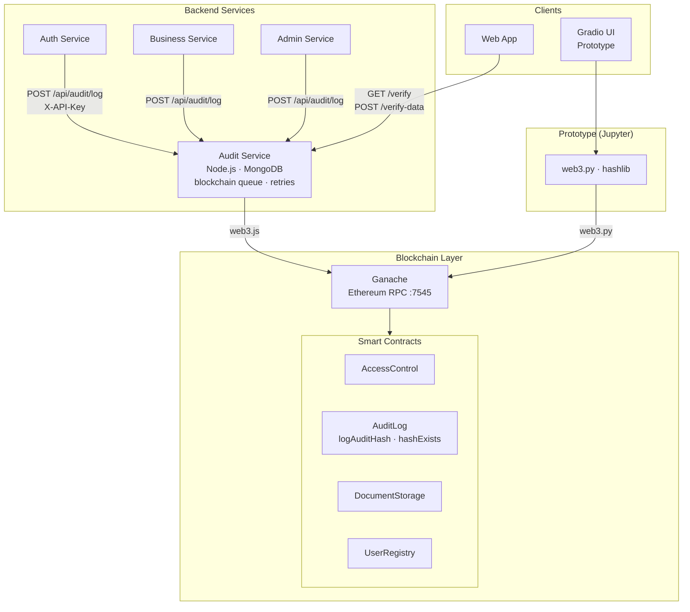
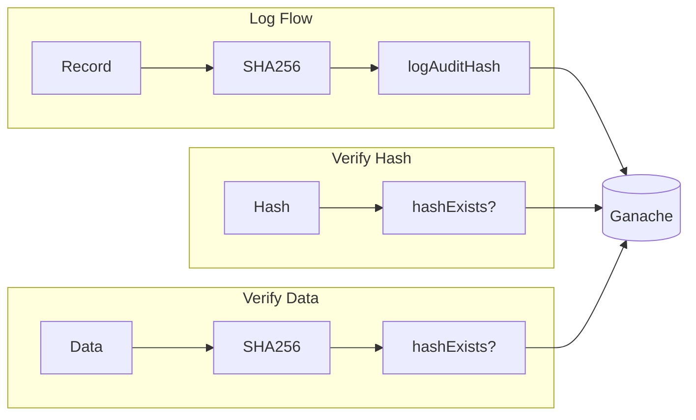

# BizClear: Blockchain Audit Prototype for Alaminos City BPLO

## 1. Problem Statement

Permit and inspection records must be tamper-proof and verifiable. Paper records and centralized databases can be altered without detection. LGU auditors and citizens need a way to verify that records have not been modified after issuance.

## 2. Core Feature

A blockchain-based audit trail that:
- Stores cryptographic hashes (SHA256) of permit and inspection records on-chain
- Uses Ganache (Ethereum) and Solidity smart contracts (AuditLog, DocumentStorage, UserRegistry)
- Enables tamper detection: modified records produce different hashes, verification fails
- **Prototype (notebook):** embedded Gradio UI — audit logs table, verify hash, verify data, log test events, rate limiting (5 logs/min)
- **Production (audit-service):** Node.js microservice with MongoDB persistence, blockchain queue, retries, `POST /api/audit/verify-data`, rate limit (20 logs/min), service-to-service auth (`X-API-Key`), least-privilege audit history

## 3. User Story and Acceptance Criteria

As an auditor or system admin, I want to verify that an audit record's hash exists on the blockchain so that I can confirm the record has not been tampered with since it was logged.

**Acceptance criteria:**
- Hash can be logged to blockchain (requires AUDITOR_ROLE)
- Any party can verify a hash exists on-chain (read-only)
- Verify Data: paste original content → hash → verify against on-chain (hash is one-way; we verify data matches)
- Tampered data produces different hash; verification fails
- Prototype runs in notebook with embedded Gradio UI (logs table, verify hash, verify data, test scenarios)

## 4. Simple Diagram

```
[Audit Record] → [SHA256 Hash] → [logAuditHash] → [Ganache/Blockchain]
                                    ↓
[Verify Request] → [hashExists(hash)] → true/false

[Verify Data] → [SHA256(original)] → [hashExists(hash)] → verified / not found
```

## 4.1 Architecture Diagram





## 5. Tools/APIs

- **Blockchain:** Ganache, Truffle, Solidity
- **Python (notebook):** web3.py, eth-account, hashlib, python-dotenv
- **Node.js (audit-service):** web3.js, express
- **UI:** Gradio (embedded in Jupyter notebook)
- **Environment:** Docker (Ganache, deploy-contracts, audit-service), Jupyter, GitHub Codespaces

## 6. Test Plan

- **Happy Path:** Log hash → Verify hash → Returns true
- **Verify Data:** Paste original content → Verify → Returns verified/not found
- **Tamper Detection:** Modify data → New hash → Verify original → Returns false
- **Security:** Only AUDITOR_ROLE can log; re-entrancy mitigated; rate limiting (notebook: 5/min; audit-service: 20/min)

## 7. Risks & Mitigations

- **Risk 1:** Ganache not running
  - **Mitigation:** docker-compose up -d ganache; clear README
- **Risk 2:** Contract addresses change after Ganache restart
  - **Mitigation:** Notebook reads from .env first (updated by deploy-contracts), then build artifacts; sanity check for empty contract code

## 8. Roles & Timeline

- **Blockchain:** Smart contracts (existing), Truffle deploy
- **Notebook:** web3.py interaction, Gradio UI (logs table, verify hash, verify data, test scenarios)
- **Audit-service:** Full stack integration with MongoDB, queue, rate limiting, verify-data endpoint
- **Demo:** Run notebook with Ganache up; or full stack via docker-compose up

**Timeline:** Phase 1B (presentation materials).
