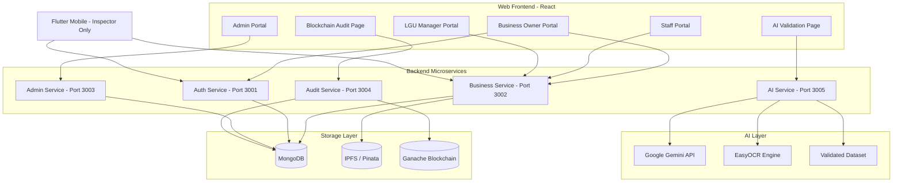
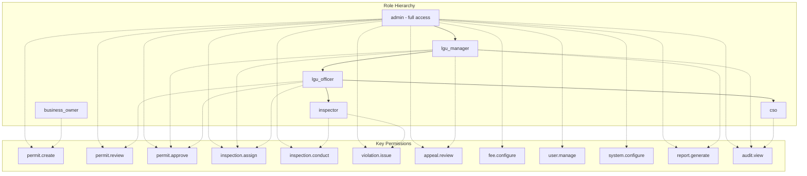

# BizClear Capstone -- Complete Overhaul Plan

**Status:** Phase 1 completed (Feb 2025). Phase 2 (Core Workflow Overhaul) is next.

---

## Discovery: Project Gaps (Fresh-Eye Review)

A cold-read of the codebase surfaces these gaps and feasibility notes:

| Gap                              | Finding                                                                                                                                              | Feasibility                                                                                              |
| -------------------------------- | ---------------------------------------------------------------------------------------------------------------------------------------------------- | -------------------------------------------------------------------------------------------------------- |
| **GEMINI_API_KEY**               | `.env.example` has no `GEMINI_API_KEY`; Phase 1A notebook needs it                                                                                   | Add to .env.example; user supplies key                                                                   |
| **Notebook requirements**        | `ai/` has ID verification deps; no `google-generativeai`, `xgboost` for form validation notebook. `blockchain/` is Node.js; notebook needs `web3.py` | Create `ai/notebooks/requirements.txt` and `blockchain/notebooks/requirements.txt`                       |
| **Capstone form assets**         | Plan says "photos saved in /assets/" but no `/assets/` or `docs/capstone-appendix/` exists                                                           | Create `docs/capstone-appendix/` placeholder; user adds form photos manually                             |
| **README broken link**           | README links to `[Blockchain.md](Blockchain.md)` which does not exist                                                                                | Point to `blockchain_prototype_plan.md` or `docs/blockchain-logging-flows.md`                            |
| **Line of business / tax codes** | `industries.js` has limited options; Alaminos uses LGU-specific tax codes (C, D, C-D). No public fee schedule for general permits.                   | Phase 2B: add `lineOfBusiness.js` from General Trias; Phase 2C: use General Trias fee structure as basis |
| **blockchain/notebooks**         | Folder does not exist                                                                                                                                | Create in Phase 1B                                                                                       |
| **ai/notebooks**                 | Only README_NOTEBOOK.md; no prototype notebook                                                                                                       | Create in Phase 1A                                                                                       |

**Feasibility:** Phase 1 is doable with the prep items above. Notebooks run outside Docker (local Python). Prototype UIs are embedded in notebooks (ipywidgets, Gradio, or Streamlit)—no separate web app pages.

---

### Discovery: Additional Gaps (Fresh-Eye Review, Continued)

| Gap                                  | Finding                                                                                                                                                                                                                               | Feasibility                                                                                                                                                                    |
| ------------------------------------ | ------------------------------------------------------------------------------------------------------------------------------------------------------------------------------------------------------------------------------------- | ------------------------------------------------------------------------------------------------------------------------------------------------------------------------------ |
| **Filipino language support (i18n)** | Capstone Scope says "English and Filipino only" but there is NO i18n. No react-i18next, no locale files, no language switcher. All UI strings hardcoded in English. `index.html` has `lang="en"`. `errorMessages.js` is English-only. | Add Phase: react-i18next (or similar), `locales/en.json` and `locales/fil.json`, language switcher in header/settings, wrap all user-facing strings. Non-trivial but standard. |
| **Mobile i18n**                      | Flutter app has no `flutter_localizations` or `easy_localization`. Mobile is English-only.                                                                                                                                            | Add `flutter_localizations`, `easy_localization`, ARB files for en/fil.                                                                                                        |
| **Backend API locale**               | API error messages and validation responses are English. No `Accept-Language` handling.                                                                                                                                               | Optional: add locale header support, localized error codes. Lower priority than frontend.                                                                                      |
| **CONTRIBUTING.md**                  | No contribution guidelines for new developers.                                                                                                                                                                                        | Create CONTRIBUTING.md with setup, branch strategy, PR process.                                                                                                                |
| **CHANGELOG**                        | No changelog to track version history.                                                                                                                                                                                                | Create CHANGELOG.md, keep-a-changelog format.                                                                                                                                  |
| **API documentation**                | No OpenAPI/Swagger spec. BACKEND_README exists but may not cover all endpoints.                                                                                                                                                       | Phase 4 or later: OpenAPI spec, or at least endpoint inventory.                                                                                                                |
| **Print/PDF styling**                | Permit PDFs, receipts, certificates—no print-specific styles or Filipino/localized formatting.                                                                                                                                        | Phase 2: PDF/print templates with locale-aware formatting.                                                                                                                     |

---

### Discovery: LGU Fee & Line-of-Business Taxonomy

**Alaminos City** does **not** have a document similar to General Trias for general business permits:

- **Alaminos Ordinance 2005-05** ([alaminoscity.gov.ph/forms/05 FEES.pdf](https://www.alaminoscity.gov.ph/forms/05%20FEES.pdf)): Only fixed fees — Mayor's Permit ₱50, Inspection ₱100 (or ₱200 for essential-commodities dealers). No line-of-business taxonomy or gross-sales brackets.
- **Alaminos Citizens Charter** ([AlaminosCityCitizensCharter-FULL.pdf](https://www.alaminoscity.gov.ph/public-service/city-services/AlaminosCityCitizensCharter-FULL.pdf)): Covers fishing gear, fishpen/fishtrap, agriculture, cooperatives, occupational permits — **not** general retail/manufacturing/contractor business taxonomy or fee schedules.

**General Trias (Cavite)** has a comprehensive BPLO Citizens Charter ([Citizen's Charter - OCBPLO 2025](https://www.generaltrias.gov.ph/storage/pdf_files/Citizen%27s%20Charter%20-%20OCBPLO%202025..pdf)) with:

- **Line of Business** list with sentence-like descriptions (e.g., "Canteens, Eateries, Food Stands, Bakeries, Catering Services"; "Beauty Parlor, Barber Shop, Massage/Fitness Center")
- **Mayor's Permit Fee** per line of business (Heavy Industries, Medium Industries, Food Industries, Trading/Retail/Wholesale, etc.)
- **Business Tax** brackets by gross sales (manufacturers, wholesalers, retailers, contractors, banks, etc.) aligned with RA 7160 Section 143
- **Sanitary inspection fee** by area (sq.m.)
- **Environmental protection fee** by business type

**Recommendation:** Use General Trias as the **basis** for Phase 2B (line-of-business dropdown options) and Phase 2C (fee computation engine). Alaminos may use LGU-specific tax codes (e.g., C, D, C-D) in their system — obtain official list from BPLO (Wilfredo Villena); until then, General Trias structure serves as a placeholder aligned with RA 7160.

---

## Situation Summary

After visiting the Alaminos City BPLO, significant mismatches were found between the current system and actual government workflows. The BPLO uses a **tightly integrated system** where:

- Business owners fill out **one unified form**
- Officers encode the form data into their system
- The system auto-generates all required certificates
- The entire process takes ~20 minutes for new permits
- Permits expire Dec 31 each year; renewal is every January
- Business activities use **PSIC 2019 codes** (A-U sections, 5-digit sub-classes)
- Tax fees are computed based on business activity type + gross sales/capitalization

The current codebase has wrong workflows, an AI model trained on ID verification (not needed), and static dashboard data.

---

## Priority Phases (Ordered by Deadline)

### PHASE 1 -- PRESENTATION MATERIALS (Must be done FIRST -- morning deadline)

#### 1 Prep. Environment and Notebook Setup

**What:** One-time setup so Phase 1A/1B notebooks and UIs can run.

- Add `GEMINI_API_KEY` to [.env.example](/.env.example) (user supplies key from Google AI Studio)
- Create `ai/notebooks/requirements.txt` with: `google-generativeai`, `scikit-learn`, `xgboost`, `pandas`, `matplotlib`, `seaborn`, `jupyter`, `gradio` (or `streamlit`) for embedded prototype UI
- Create `blockchain/notebooks/requirements.txt` with: `web3`, `jupyter`, `gradio` (or `streamlit`) for embedded prototype UI
- Create `docs/capstone-appendix/` directory with README instructing user to add form photos (unified form, general permit, retirement, occupational, ARTA, citizens charter)
- Fix README.md: change `[Blockchain.md](Blockchain.md)` link to `[blockchain_prototype_plan.md](blockchain_prototype_plan.md)` or `[docs/blockchain-logging-flows.md](docs/blockchain-logging-flows.md)`

#### 1A. AI Document Validation Jupyter Notebook

**What:** Replace ID verification with Gemini-powered unified form validation prototype.

**Approach:**

- Create `/ai/notebooks/ai_document_validation_prototype.ipynb`
- Use `google-generativeai` Python SDK (Gemini 1.5 Flash -- free tier: 60 RPM)
- Create a synthetic validated dataset (`/ai/datasets/unified_form_validation_dataset.csv`) based on the photographed forms, containing:
  - Sample business applications with correct data (valid entries)
  - Sample business applications with common errors (missing fields, wrong PSIC codes, invalid addresses, inconsistent data)
  - Expected validation results for each entry
- Notebook sections:
  1. **Introduction** -- problem statement, why AI for form validation
  2. **Dataset Loading & Exploration** -- load the validated dataset, show class distributions, feature statistics
  3. **Preprocessing** -- clean data, handle missing values, feature encoding (categorical to numerical), normalization
  4. **Data Splitting** -- train/test/validation split (70/15/15 or 80/10/10), stratified sampling to preserve class balance
  5. **Traditional ML Pipeline (6 Algorithms)** -- **CRITICAL: Professor expects this.** Train and compare:
    - **SVM** (Support Vector Machine) -- with RBF and linear kernels
    - **RF** (Random Forest) -- with feature importance analysis
    - **DT** (Decision Tree) -- with tree visualization
    - **LR** (Logistic Regression) -- as baseline
    - **XGB** (XGBoost) -- gradient boosting
    - **NN** (Neural Network) -- simple feedforward network
  6. **Model Optimization** -- hyperparameter tuning (GridSearchCV or RandomizedSearchCV), cross-validation (k-fold, k=5)
  7. **Overfitting/Underfitting Prevention** -- learning curves, regularization (L1/L2), early stopping, dropout (for NN), train vs validation loss comparison
  8. **Model Comparison & Selection** -- accuracy, precision, recall, F1-score, confusion matrix for each of the 6 models, ROC curves, select best performer
  9. **Generative AI Integration (Gemini)** -- connect to Gemini API using structured prompts with BPLO domain knowledge (PSIC codes, required fields, validation rules). Compare Gemini results against best traditional ML model.
  10. **Prompt Engineering** -- define the system prompt following structured format (role, context, task, output format, constraints, examples). Show how prompt design affects output quality.
  11. **Combined Approach** -- show how traditional ML + Gemini work together (ML for structured field validation, Gemini for semantic/contextual validation)
  12. **Deployment Pipeline** -- raw data -> preprocessing -> splitting -> training -> optimization -> deployment diagram. How this integrates into BizClear.
  13. **Accuracy Measurement** -- final evaluation on held-out test set, comparison table of all approaches
- The prompt must follow structured prompt engineering (role, context, task, output format, constraints)
- Create prompt documentation file: `/docs/ai_prompt_documentation.md`
- Create AI pipeline documentation: `/docs/ai_model_pipeline.md` explaining each step from raw data to deployment

**Embedded Prototype UI:** The notebook must include code that launches an interactive interface when run (e.g., `ipywidgets`, `Gradio`, or `Streamlit`). When the user runs the notebook, it opens a window where they can: upload a scanned form, run validation, view field-by-field results, upload/manage the dataset, see model metrics. The prototype is self-contained in the notebook; it is NOT part of the BizClear web app.

**Key files to create:**

- `[ai/notebooks/ai_document_validation_prototype.ipynb](ai/notebooks/ai_document_validation_prototype.ipynb)` -- main notebook
- `[ai/datasets/unified_form_validation_dataset.csv](ai/datasets/unified_form_validation_dataset.csv)` -- synthetic dataset (100+ entries: ~60% valid, ~40% with various errors)
- `[docs/ai_prompt_documentation.md](docs/ai_prompt_documentation.md)` -- prompt documentation with role/context/task structure
- `[docs/ai_model_pipeline.md](docs/ai_model_pipeline.md)` -- full pipeline documentation (raw data -> preprocess -> split -> train 6 algorithms -> optimize -> evaluate -> deploy)

**Key files to delete:**

- `ai/id-verification/` -- entire directory
- `ai/models/` -- old trained models
- `backend/services/ai-service/src/models/id_verification.py`
- Any `.h5` or `.joblib` model files

#### 1B. Blockchain Audit Jupyter Notebook

**What:** Create a working blockchain audit trail prototype with Ganache.

**Approach:**

- Create `/blockchain/notebooks/blockchain_audit_prototype.ipynb`
- Use `web3.py` to interact with deployed Solidity contracts
- Notebook sections:
  1. **Introduction** -- why blockchain for audit logging, immutability guarantees
  2. **Environment Setup** -- connect to Ganache, load contract ABIs
  3. **Smart Contract Interaction** -- demonstrate AuditLog, DocumentStorage, UserRegistry contracts
  4. **Audit Trail Demo** -- log a permit application event, verify hash, retrieve logs
  5. **Document Storage Demo** -- store a document CID on IPFS, record on-chain
  6. **Tamper Detection** -- attempt to modify a record, show verification failure
  7. **Security Analysis** -- re-entrancy test using `onlyOwner` modifier, SHA-256 hash verification
  8. **Performance Metrics** -- gas costs, transaction times
- Start Ganache via Docker, deploy contracts, run tests

**Key files to create:**

- `[blockchain/notebooks/blockchain_audit_prototype.ipynb](blockchain/notebooks/blockchain_audit_prototype.ipynb)`
- Update `[blockchain_prototype_plan.md](blockchain_prototype_plan.md)` to reflect AI document validation (not form definitions) as the core feature

**Embedded Prototype UI:** The notebook must include code that launches an interactive interface when run (e.g., `ipywidgets`, `Gradio`, or `Streamlit`). When the user runs the notebook, it opens a window with the interface—upload form, run validation, view results, etc. The prototype is self-contained in the notebook; it is NOT part of the BizClear web app.

#### 1D. Prototype Plan Documents

**Create:** `ai_validation_prototype_plan.md` - same format as blockchain_prototype_plan.md (problem statement, core feature, user story, diagram, tools, test plan, risks).

**Update:** [blockchain_prototype_plan.md](blockchain_prototype_plan.md):

- Change core feature from "Form Definition Management" to "AI Document Validation + Blockchain Audit"
- Update user stories, test plan, and risks

**Create:** `blockchain_audit_prototype_plan.md` - same format for the blockchain audit feature

#### 1E. Capstone Document -- Chapter 2 (Methodology)

**Also update Chapter 1** -- current Chapter 1 states processing takes "15-20 working days" and requires "5-8 office visits." After the field visit, the actual numbers are ~20 minutes processing and 1 visit. These objectives and performance targets need to be adjusted to reflect reality. Also update the system description to match the actual BPLO workflow (unified form, PIS, PSIC codes, etc.).

Add Chapter 2 to `[capstone_document.md](capstone_document.md)` with:

- **Research Design:** Qualitative descriptive research (fewer than 10 respondents -- BPLO officer Wilfredo Villena as primary). Cite rationale for choice.
- **Software Development Methodology:** Identify specific agile methodology (e.g., Extreme Programming or Kanban given the rapid iteration). Include figure/diagram of phases. Discuss each phase in past tense.
- **Scope and Delimitation:**
  - Paragraph 1: Feature list (permit processing, AI validation, blockchain audit, inspections, renewals, retirement, occupational permits, post-requirements)
  - Paragraph 2: What the system does NOT cover (no national database integration, no actual payment processing, no special permits like ECC/liquor, no multi-language beyond English/Filipino)
- **Data Gathering Techniques:**
  - **Interview** with BPLO officer Wilfredo Villena -- questions asked, findings
  - **Observation** at the Business One-Stop Shop (BOSS)
  - **Document Analysis** -- physical forms collected (unified form, general permit form, retirement form, occupational permit form, ARTA monitoring form, citizens charter, post-requirements lists)
  - Note: Include forms in appendices
- **Sources of Data:**
  - Primary: Interview with Wilfredo Villena (BPLO officer, Alaminos City)
  - Secondary: RA 11032, RA 7160 (Local Government Code), PSIC 2019, DILG guidelines, ARTA regulations

---

### PHASE 2 -- CORE WORKFLOW OVERHAUL (Web App)

#### 2A. Personal Information System (PIS) Registration

**Current state:** Registration collects basic info (name, email, password).
**Required changes to `[backend/services/auth-service/](backend/services/auth-service/)` and `[web/src/features/authentication/](web/src/features/authentication/)`:**

- Add to User model: `address` (street, barangay, city, province, zipCode), `maritalStatus`, `dateOfBirth`, `placeOfBirth`, `nationality`, `spouseName`, `fatherName`, `motherName`, `distinctiveMark`, `highestEducationalAttainment`
- Update signup flow to collect PIS-required fields
- **Duplicate prevention:** During registration, check if email already exists in PIS. Add a "I already have a permit" flow that:
  1. Asks for email + business plate number
  2. Searches PIS for match
  3. Sends verification code to the PIS-registered email
  4. On verification, links the web account to the existing PIS record
- Remove ID verification step from the registration/business-registration wizard

#### 2B. Unified Business Permit Form

**Current state:** Multi-step wizard with document uploads and ID verification.
**Required changes to `[web/src/features/business-owner/features/business-registration/](web/src/features/business-owner/features/business-registration/)`:**

- Replace current wizard steps with the unified form structure matching the photographed forms:
  - **Application type:** New / Renewal / Amendment / Additional
  - **Organization type:** Single/Partnership/Corporation/Cooperative
  - **Business Plate No.** and **Year Established**
  - **Taxpayer info:** Name, business name, trade name/franchise
  - **President/Treasurer of Corporation** (if applicable)
  - **Business Address** fields (house/bldg no, building name, street, barangay, subdivision, block code, contact, email, PIN, building registry no, business area in sq.m., total employees, employees residing in LGU)
  - **Owner's Address** fields
  - **Lessor information** (if renting): name, business address
  - **Emergency contact**
  - **Business Activity section** (CRITICAL):
    - Dropdown for Tax Code (Alaminos uses LGU-specific codes e.g., C, D, C-D; see docs/alaminos_tax_code_structure.md). Obtain official list from BPLO; until then use General Trias category structure as placeholder.
    - **Line of Business** dropdown with sentence-like descriptions per General Trias (e.g., "Canteens, Eateries, Food Stands, Bakeries, Catering Services"; "Beauty Parlor, Barber Shop, Massage/Fitness Center"; "General Merchandise, Grocery, Sari-Sari Store"). Options cascade from tax code/category.
    - Detailed Line of Business dropdown
    - Multiple business activities support (table format)
  - **Capital (Initial):** Building, Machineries/Equipment/Vehicles (MEV table)
  - **Accreditations/Licenses:** DTI/SEC/CDA, NFA, BFAD, BIR, TIN, Other
  - **Operating Capital:** Equity, Payable
  - **Oath of Undertaking**
- Add shared constants: `[backend/shared/constants/lineOfBusiness.js](backend/shared/constants/lineOfBusiness.js)` — line-of-business taxonomy from General Trias Citizens Charter (Annex 1). Map to tax categories (e.g., LGC Section 143). Alaminos tax codes (C, D, C-D) to be obtained from BPLO; placeholder mapping until confirmed.

#### 2C. Business Activity & Fee Computation

**New feature** -- Add fee computation engine. **Basis: General Trias Citizens Charter** ([Citizen's Charter - OCBPLO 2025](https://www.generaltrias.gov.ph/storage/pdf_files/Citizen%27s%20Charter%20-%20OCBPLO%202025..pdf))—Alaminos does not publish a similar line-of-business fee schedule for general business permits.

- Create `[backend/services/business-service/src/lib/feeCalculator.js](backend/services/business-service/src/lib/feeCalculator.js)`:
  - **Mayor's Permit Fee:** By line of business per General Trias Annex 1 (e.g., Heavy Industries ₱12,000; Canteens/Food Stands ₱600–₱1,200; General Merchandise ₱300–₱1,200; Banks ₱6,000; Peddler ₱360). Stored in admin-editable `FeeSchedule` by `lineOfBusiness` key.
  - **Local Business Tax:** Gross-sales brackets per RA 7160 Section 143 categories (manufacturers, wholesalers, retailers, contractors, banks, etc.)—use General Trias tax tables as template (e.g., manufacturers: ₱199.50 for &lt;₱10K up to 45% of 1% for ₱6.5M+; retailers: 2.2% on first ₱400K, 1.1% above).
  - **Regulatory fees:** Sanitary by area (sq.m.), environmental protection by business type—reference General Trias schedules. Garbage, fire safety, zoning configurable by admin.
- Create admin page for managing fee schedules: `/admin/fee-schedules`
  - Editable line-of-business → Mayor's Permit Fee mapping
  - Editable gross-sales brackets and rates per business tax category
  - Penalty configuration (25% surcharge + 2% monthly interest)
- Fee schedule stored in MongoDB and editable (not hardcoded)
- New model: `FeeSchedule` with fields: `lineOfBusiness`, `mayorsPermitFee`, `businessTaxCategory`, `brackets[]` (min, max, rate), `effectiveDate`, `isActive`

#### 2D. Permit Processing Workflow (Officer Side)

**Current state:** LGU officer reviews uploaded documents.
**Required changes to `[web/src/features/staff/](web/src/features/staff/)` and `[backend/services/business-service/](backend/services/business-service/)`:**

- **Walk-in support:** Officer can create applications on behalf of walk-in business owners:
  1. Check if business owner exists in PIS (search by name/email)
  2. If not, create PIS record first
  3. Fill in unified form with business details
  4. System auto-generates required certificates (CTC, etc.)
  5. Encode business activities with PSIC codes
  6. System computes fees based on business activities
  7. Print permit (PDF generation with PDFKit)
- **Online application support:** Business owner submits via web, officer reviews:
  1. Officer verifies submitted form data
  2. AI validates the form (Gemini)
  3. Officer approves/requests corrections
  4. System computes fees
  5. Business owner pays (simulated for now -- auto-success on click)
  6. Permit issued

#### 2E. Renewal Process

**New workflow in `[backend/services/business-service/src/routes/renewal.js](backend/services/business-service/src/routes/renewal.js)`:**

- Every January, system flags all active businesses for renewal
- Business owner or officer submits:
  - Financial statements / sworn statement of gross sales
  - Updated business information (if changed)
- System computes renewal fees based on reported gross sales
- **Penalty calculation:** If past January 20:
  - 25% surcharge on total unpaid fees
  - 2% monthly interest on (fees + surcharge) for each month late
- Renewal preserves the same business permit number
- 3-step simplified process (matching the photographed citizens charter):
  1. Submit pre-requirements (10 min)
  2. Assessment and payment (30 min)
  3. Securing permit and sticker (20 min)

#### 2F. Business Retirement/Cessation

**Update `[web/src/features/business-owner/](web/src/features/business-owner/)` cessation feature:**

- Business owner submits retirement application (letter to City Mayor thru City Treasurer)
- Required info: business name, BP number, address, years active
- Attached: sworn statement of gross sales/receipts
- Inspector visits to verify business is actually closed
- If confirmed, business status changes to "retired"
- If business owner returns later, they must:
  1. Settle all outstanding penalties
  2. Apply for a NEW business permit (new BP number)

#### 2G. General Permits

**New feature:**

- Support for special permit types: Cooperative, Association/Foundation, Chainsaw Permit, Firecrackers Stallholders, Bazaar/Festival Vendors, Peddlers, Promotions/Exhibitors, Cemetery Stallholders, Fish Trap/Fish Pen, Fish Pond
- Each has different requirements (listed in the photographed requirements form CBPLO-GPI-F06)
- Create a `GeneralPermit` model or extend `BusinessProfile` with a `permitCategory` field
- Admin can configure requirements per permit category

#### 2H. Occupational Permits (Employee Permits)

**New feature:**

- Business owners can submit occupational permit applications for each employee
- Form fields (from photographed form CBPLO-OPR-F013):
  - Personal info (name, gender, civil status, DOB, address, education)
  - Employment info (business plate no., employer, company, position)
  - Type: Self-Employed or Employed
  - Educational background
- Requirements: Barangay Clearance, CTC, PIS Registration
- Lab exams required:
  - **Food handlers:** Urinalysis, Fecalysis, Hepa B Screening, Chest X-Ray
  - **Non-food handlers:** Drug Test, Chest X-Ray
- Processing time: ~30 days (waiting for lab results)
- New model: `OccupationalPermit` with status tracking

#### 2I. Post-Requirements Tracking

**New feature:**

- After permit issuance, track post-requirements:
  - **New permits:** Real Property Tax Clearance, Garbage Fee, Sanitary Permit, Zoning Clearance, FSIC
  - **Renewals:** Sanitary Permit, Building Clearance, FSIC
- 30 working days compliance period
- Non-compliance = temporary suspension/closure
- Dashboard widget showing post-requirement status per business

#### 2J. Inspection Workflow Updates

**Update `[backend/src/models/Inspection.js](backend/src/models/Inspection.js)` and related frontend:**

- After permit issuance, BPLO schedules joint inspection (4-5 officers)
- Each officer inspects their domain (health, fire, sanitary, etc.)
- If all pass: no more inspections for the year
- If issues found:
  - Report back to BPLO
  - Business owner given compliance period (variable based on severity)
  - Inspector returns on deadline to re-inspect
  - If still non-compliant with valid reason: extend deadline
  - If non-compliant without valid reason: penalize + future inspections become **unannounced**
  - Third violation: permit revoked, authorities involved
- Complaint-driven inspections:
  - Customer reports to barangay hall first
  - Barangay escalates to BPLO if needed
  - BPLO sends inspector

#### 2K. Appeals System

- Business owner can appeal officer/inspector mistakes
- LGU Manager receives and reviews appeals
- Appeal types: incorrect fees, wrong violations, processing errors

#### 2M. Abandoned Business Auto-Detection

- **Cron job** (monthly, starting February): scan for businesses that haven't renewed past the January deadline
- Auto-flag overdue businesses with status `renewal_overdue`
- If 2+ months overdue (March), auto-assign inspection to verify if business is still operating
- Inspector visits and reports: `operating_no_renewal` (apply penalties) or `abandoned` (mark as closed)
- If abandoned: business status -> `closed_abandoned`, business permit number retired
- If owner returns later: must settle all penalties BEFORE applying for a new permit with a NEW BP number
- Implementation: add `checkAbandonedBusinesses()` to existing `node-cron` in business-service

#### 2N. Business Information Edit Requests

- Business owner can request to change business information (address, trade name, business activities, etc.)
- Officer reviews and approves the change (quick process per BPLO interview)
- Change is logged in audit trail with before/after values
- Blockchain hash updated after change

#### 2O. Admin Penalty Fee Configuration

- Admin page at `/admin/penalty-configuration`:
  - Configurable surcharge percentage (default: 25%)
  - Configurable monthly interest rate (default: 2%)
  - Configurable compliance periods per violation type
  - Effective date for changes (not retroactive)
- Stored in `PenaltyConfiguration` model (not hardcoded)
- Fee calculator reads from this configuration

#### 2P. Admin Account Policy

- The existing 3 admin accounts approach is reasonable and aligns with standard practice (separation of duties, mutual oversight)
- Document the rationale: at least 2 admins required for critical operations (approval workflows already require multi-admin sign-off via `AdminApproval` model)
- Admin accounts cannot self-approve sensitive operations (already enforced)
- Add admin activity dashboard showing each admin's recent actions for peer review

#### 2L. Dashboard Overhaul

**Remove all static/hardcoded data from dashboards:**

- `[web/src/features/business-owner/views/pages/BusinessOwnerDashboard.jsx](web/src/features/business-owner/views/pages/BusinessOwnerDashboard.jsx)` -- replace static cards with real data from API
- `[web/src/features/admin/views/pages/AdminDashboard.jsx](web/src/features/admin/views/pages/AdminDashboard.jsx)` -- same
- `[web/src/features/lgu-manager/views/pages/LGUManagerDashboard.jsx](web/src/features/lgu-manager/views/pages/LGUManagerDashboard.jsx)` -- same

**LGU Manager dashboard should show:**

- Overview of inspectors and their progress
- Complaint/appeal alerts
- Permit application statistics
- Revenue reports
- Staff management for their department

---

### PHASE 3 -- AI SERVICE OVERHAUL

#### 3A. Replace AI Service

**Remove from `[backend/services/ai-service/](backend/services/ai-service/)`:**

- `src/models/id_verification.py` -- delete
- Update `requirements.txt`: remove `tensorflow`; add `google-generativeai`, `xgboost`, `pandas`, `matplotlib`, `seaborn` (keep `scikit-learn` for traditional ML pipeline in notebook)
- **Replace EasyOCR with Gemini Vision for OCR** -- User noted OCR is not good. Gemini 1.5 Flash supports image input natively and can extract structured text from scanned forms far more accurately than EasyOCR. Update `src/models/ocr.py` to:
  - Accept image input
  - Send to Gemini with a prompt: "Extract all text fields from this business permit application form and return as structured JSON"
  - Fall back to EasyOCR only if Gemini is unavailable
  - Remove Philippine ID-specific parsing (driver's license, PhilSys, etc.)

**Add (Hybrid Approach -- ML + Gemini working together):**

- `src/models/ml_validator.py` -- **Traditional ML model** for structured field validation:
  - Loads the best-performing model from the notebook (saved as `.joblib` after training)
  - Fast, deterministic scoring of tabular features (missing field counts, dropdown validity flags, numeric range checks, format validation)
  - Returns: `is_valid` (bool), `confidence` (float), `error_flags` (list of specific issues)
  - Runs first as a fast pre-filter before invoking Gemini
- `src/models/gemini_validator.py` -- **Gemini-powered** semantic/contextual validation:
  - Accepts form data (JSON) + optional scanned document (image)
  - Uses structured prompt with BPLO domain knowledge
  - Handles what ML cannot: semantic consistency ("line of business matches PSIC code"), contextual checks ("lessor info required when renting"), OCR extraction from scanned forms
  - Returns field-by-field validation results with human-readable explanations
- `src/models/hybrid_validator.py` -- **Combined orchestrator**:
  - Step 1: Run ML validator (fast, deterministic)
  - Step 2: If ML flags issues OR if scanned document provided, run Gemini validator
  - Step 3: Merge results -- ML provides structured flags, Gemini provides explanations
  - Returns unified validation result with both ML confidence scores and Gemini explanations
- `src/routes/form_validation.py` -- new endpoints:
  - `POST /api/ai/validate-form` -- hybrid validation (both ML + Gemini)
  - `POST /api/ai/validate-form/ml-only` -- ML-only validation (fast, no API cost)
  - `POST /api/ai/validate-form/scan` -- OCR + validation from scanned form image (Gemini Vision)

The best ML model artifact (`.joblib`) is saved from the notebook and loaded at service startup.

#### 3B. Update Docker Configuration

- `[docker-compose.yml](docker-compose.yml)`: remove model volume mount, add `GEMINI_API_KEY` env var
- `[docker-compose.dev.yml](docker-compose.dev.yml)`: same changes
- `[.env.example](/.env.example)`: add `GEMINI_API_KEY` placeholder

#### 3C. Update Frontend AI Integration

- Remove ID verification from `[LGUDocumentsUploadStep.jsx](web/src/features/business-owner/features/business-registration/components/LGUDocumentsUploadStep.jsx)`
- Update business registration wizard to use new form validation endpoint
- When officer/business owner fills the unified form, optionally trigger AI validation before submission

#### 3D. Update Admin Form Definitions Feature

- The existing form definitions admin UI (`/admin/form-definitions`) has content that is "wrong now" per the user
- Update the seeded form definitions (`[backend/services/admin-service/src/migrations/seedFormDefinitions.js](backend/services/admin-service/src/migrations/seedFormDefinitions.js)`) to reflect the actual unified business permit form structure
- Form definitions should now focus on: unified business permit form, general permit form, occupational permit form, retirement application form
- The form definitions feature itself (versioning, draft/publish) is still valid -- the form does occasionally change and admins need to update it
- Update industry scope to use PSIC 2019 codes (A-U) instead of the current classification

---

### PHASE 4 -- DOCUMENTATION

#### 4A. AI Prompt Documentation

Create `[docs/ai_prompt_documentation.md](docs/ai_prompt_documentation.md)`:

- List all prompts used with Gemini
- For each prompt: role, context, task, output format, constraints, examples
- Explain prompt engineering methodology ("the art of prompting" -- professor is looking for this specifically)
- Show sample inputs and expected outputs
- Format each prompt with clear sections: System Role, Domain Context, Task Instructions, Output Schema, Constraints, Few-Shot Examples

#### 4A-2. AI Model Pipeline Documentation

Create `[docs/ai_model_pipeline.md](docs/ai_model_pipeline.md)`:

- Full pipeline diagram: Raw Data -> Preprocessing -> Data Splitting -> Model Training (6 algorithms) -> Optimization -> Evaluation -> Deployment
- Explain each step in detail (what was done and why)
- Document the 6 algorithms used (SVM, RF, DT, LR, XGB, NN) and why each was chosen
- Explain overfitting/underfitting prevention techniques applied
- Show how the traditional ML models compare to the Gemini generative AI approach
- Document the dataset: structure, validation status, how it will be validated by the BPLO officer
- Explain the combined approach (ML for structured validation + Gemini for semantic validation)
- This documentation is required for the capstone defense

#### 4A-3. Officer Validation & Data Request Document

Create `[docs/officer_validation_request.md](docs/officer_validation_request.md)`:

A structured document listing everything we need from the BPLO officer (Wilfredo Villena) during next week's visit. Covers capstone requirements, dataset validation, and prompt review.

**Section 1 -- Officer/Respondent Details** (for Chapter 2 primary source):

- Full name, position/title, office/department, office address
- Contact details (or note "withheld for privacy")
- Years in service, role in the process

**Section 2 -- Consent & Ethics** (for appendices):

- Consent to interview for academic/capstone purposes
- Audio recording allowed? Photos of forms allowed? Name can be cited?
- Data privacy handling statement

**Section 3 -- Workflow Validation** (align system with real BPLO process):

- New permit walk-in steps (verify our implementation matches)
- Renewal process (financial docs, penalty rules: 25% surcharge + 2% monthly interest)
- Retirement/cessation process
- Inspection process (joint composition, compliance periods, escalation)
- Complaint process (barangay-first)

**Section 4 -- Unified Form Field Validation:**

- Which fields are required vs optional
- Which fields are dropdowns in their system
- Business activity table rules (multiple lines? fee combination logic?)

**Section 5 -- Tax Code / Line of Business (REQUIRED — Request as Deliverables):**

- **Request from officer:** Printed or digital copy of the **full tax code list** (e.g., A, B, C, C-D, D, E, etc.) with descriptions
- **Request from officer:** **Line of business options** per tax code — the exact dropdown options their system uses (cascading structure: tax code → line of business → detailed line). These should be the official, sentence-like descriptions (e.g., "Canteens, Eateries, Food Stands, Bakeries, Catering Services") — not AI-generated placeholders
- **If available:** Export from iBPLS or their system (tax code master list, line-of-business tree)
- **If not exportable:** Officer to dictate or provide handwritten list; we transcribe
- **Purpose:** Replace placeholder taxonomy in AI dataset, validation module, and web app with Alaminos' actual options. General Trias used as placeholder until we receive this.

**Section 6 -- Fee Computation Rules:**

- What inputs affect fees (capitalization, gross sales, renting vs owning, employees, area, activity codes)
- Which fee components exist (mayor's permit, LBT, sanitary, fire, zoning, garbage)
- Note: General Trias Citizens Charter used as basis; officer to confirm or adjust for Alaminos
- Which are post-requirements vs pre-requirements

**Section 7 -- Dataset Validation** (Gold Set for AI notebook):

- Officer validates 30-50 sample entries (mark valid/invalid + reason)
- Officer suggests 5-10 common applicant mistakes

**Section 8 -- Prompt Validation:**

- Officer reviews our Gemini prompts for correctness
- Confirms/adjusts validation criteria
- Records "Validated by BPLO officer (date)"

**Section 9 -- System Scope Confirmation:**

- Confirm what the prototype should NOT do (no national DB integration, no real payments, no internal security disclosure)

**Section 10 -- Signature/Acknowledgment:**

- Officer signature over printed name, date, office stamp (if allowed)

Also create `[docs/officer_visit_checklist.md](docs/officer_visit_checklist.md)` -- a quick checklist of what to bring and what to request:

**What to bring:**

- Printed workflow summary (1-2 pages)
- Printed Gold Set dataset (30-50 entries) or spreadsheet on device
- Printed prompt documentation (for markup)
- Copies of collected forms (for cross-checking)
- Consent form
- Camera/phone for additional photos if needed

**What to request from officer (deliverables):**

- **Tax code list** — full list of codes (A, B, C, C-D, D, etc.) with descriptions
- **Line of business options** — per tax code, the exact dropdown options (sentence-like descriptions). Export from system, or handwritten/dictated list if no export available

#### 4B. Vulnerability Documentation

Create `[docs/prototype_vulnerability_analysis.md](docs/prototype_vulnerability_analysis.md)`:

- AI vulnerabilities: prompt injection, hallucination, dataset bias, adversarial inputs
- Blockchain vulnerabilities: re-entrancy (mitigated by onlyOwner), gas limit attacks, front-running
- Mitigations for each

#### 4C. Workflow Documentation

Create `[docs/supported_workflows.md](docs/supported_workflows.md)`:

- List every workflow the app supports with step-by-step descriptions
- New business permit application (online + walk-in)
- Renewal process
- Business retirement/cessation
- Occupational permits
- General permits
- Inspections (scheduled, follow-up, unannounced, complaint-driven)
- Appeals
- Penalty computation

#### 4D. Change Summary

Create `[docs/change_summary.md](docs/change_summary.md)`:

- Every change made, organized by component

#### 4E. Capstone Appendices

Prepare appendix references in capstone document:

- Photos of forms (already saved as assets)
- Interview details (Wilfredo Villena, BPLO officer)
- Observation form template
- Citizens Charter photos

---

### PHASE 5 -- SECURITY, COMPLIANCE & RBAC

#### 5A. Information Assurance Checklist (Item-by-Item)

Cross-referenced against `[information_assurance_and_security_checklist.md](information_assurance_and_security_checklist.md)`:

**Category 1 -- Authentication (9/9 implemented, need post-change verification):**

- Strong password hashing (bcrypt) -- auth-service uses bcrypt
- Secure sessions with expiry -- JWT with expiry + token versioning
- Generic login errors -- implemented (no "user not found" vs "wrong password" distinction)
- Rate limiting for logins -- implemented
- MFA available or enforced -- TOTP, biometric, WebAuthn all exist
- Validated tokens (JWT) -- `requireJwt` middleware on all protected routes
- Strong password policy -- enforced at signup/change
- Logout invalidates session -- session invalidation + token version bump
- OAuth/SSO or advanced auth -- Google OAuth implemented
- **Action:** Run verification tests after all workflow changes to confirm nothing breaks

**Category 2 -- Input Validation (3/7 confirmed, 4 need work):**

- All inputs validated server-side -- Joi schemas on existing endpoints
- [~] Parameterized SQL queries -- **N/A** (MongoDB, not SQL). Document this in checklist as: "Not applicable; NoSQL injection protection via Mongoose query sanitization covers this requirement."
- **[!] XSS protection (context-aware escaping)** -- **GAP FOUND.** React auto-escapes JSX output, but must:
  - Audit all `dangerouslySetInnerHTML` usage across `web/src/` (search and fix/remove)
  - Add `DOMPurify` or `sanitize-html` for any user content rendered as HTML
  - Verify all API responses strip or escape HTML in user-submitted fields
  - Verify mobile app (Flutter) doesn't render raw HTML from API
- **[!] File upload validation (type + size)** -- Verify on ALL upload endpoints:
  - `[backend/services/auth-service/src/routes/profile.js](backend/services/auth-service/src/routes/profile.js)` -- avatar upload
  - `[backend/services/business-service/src/routes/registration.js](backend/services/business-service/src/routes/registration.js)` -- document upload
  - `[backend/services/business-service/src/routes/inspector.js](backend/services/business-service/src/routes/inspector.js)` -- evidence upload
  - New AI validation endpoint -- scanned form upload
  - Enforce: whitelist allowed MIME types, max file size (e.g., 10MB), file extension check, magic byte validation
- NoSQL injection protection -- Mongoose sanitization + Joi input validation
- **[!] API schema validation** -- Add Joi schemas for ALL new endpoints: fee schedules, occupational permits, general permits, post-requirements, renewals, retirement, PSIC lookups, AI form validation
- **[!] CSRF tokens** -- Missing entirely. Add double-submit cookie pattern or `csurf` middleware to all state-changing (POST/PUT/PATCH/DELETE) endpoints across all services

**Category 3 -- Database Security (3/7 confirmed, 4 need work):**

- Secure credential storage (.env) -- all secrets in `.env`, not committed
- Role-based access control -- exists, hardened in Phase 5B
- Audit logging enabled -- AuditLog model + blockchain logging
- **[!] Database encryption at rest** -- Must verify/enable:
  - If using Docker MongoDB: add `--enableEncryption` and `--encryptionKeyFile` flags
  - If MongoDB Atlas: enable "Encryption at Rest" in cluster config
  - Document the chosen approach in `[docs/database_hardening.md](docs/database_hardening.md)`
- **[!] Encrypted backups** -- Concrete implementation needed:
  - Create `[backend/scripts/backup.sh](backend/scripts/backup.sh)`: `mongodump --gzip --archive | gpg --symmetric --cipher-algo AES256 -o backup_$(date +%Y%m%d).gpg`
  - Schedule via `node-cron` in admin-service (daily at 2 AM)
  - Backup retention: 30 daily, 12 monthly, 1 yearly
  - Admin UI: trigger manual backup, view backup history, download encrypted backup
  - Store in designated Docker volume or cloud bucket
- **[!] TLS database connections** -- Add `tls=true` to MongoDB connection string for production. Generate self-signed certs for dev, use CA-signed for production. Update connection strings in all `.env.example` files.
- **[!] Database hardening** -- Create `[docs/database_hardening.md](docs/database_hardening.md)`:
  - Enable authentication (`--auth`)
  - Create separate DB users per microservice with minimal privileges (auth-service: read/write users; business-service: read/write businesses; audit-service: read/write audit; admin-service: read/write config)
  - Restrict network binding (`--bind_ip 127.0.0.1,backend-network`)
  - Disable server-side JS execution (`--noscripting`)
  - Disable HTTP interface
  - Set `maxIncomingConnections` limit

**Category 4 -- Threat Modeling (3/6 done but outdated, all need updating):**

- [~] Data Flow Diagram created -- Exists in IAS document Appendix A, but outdated. **Must recreate** for new microservices + Gemini + IPFS + inspector mobile architecture.
- [~] STRIDE threats identified -- Done but **must add new threats**:
  - Gemini API: prompt injection, API key exposure, data exfiltration via prompts, hallucinated validation results
  - New endpoints: fee manipulation, PSIC code injection, unauthorized walk-in creation
  - Mobile: offline data tampering, GPS spoofing, forged evidence photos
- [~] OWASP Top 10 mapped -- Done but **must add mappings** for Gemini integration (SSRF via API calls, Insecure Design for AI reliance)
- [~] Mitigation plan with priorities -- Must reprioritize based on new architecture
- [~] Risk assessment done -- Must add risk rows for all new features
- Model updated regularly -- Add "Next Review Date" field and review schedule to IAS document

#### 5A-2. Update the IAS Document Itself

**The entire `[information_assurance_and_security.md](information_assurance_and_security.md)` must be updated** -- it describes the OLD system:

| Section                  | Current (Outdated)                                 | Must Change To                                                   |
| ------------------------ | -------------------------------------------------- | ---------------------------------------------------------------- |
| 1.1.1 System Description | "view violations, submit appeals"                  | Permit processing, AI form validation, inspections, renewals     |
| 1.1.2 Intended Users     | "Enforcement Officers", mobile for business owners | Inspectors (mobile), Business Owners (web), LGU staff (web)      |
| 1.2.1 System Scope       | Mobile = "business-owner-facing"                   | Mobile = "inspector-facing only"                                 |
| 2.1.6 AI Service         | "analyzes uploaded appeal documents"               | Validates unified business permit forms via Gemini generative AI |
| 2.2 Architecture         | Monolithic diagram                                 | Microservices (5 services) + Gemini + IPFS                       |
| 4.2 STRIDE Table         | No Gemini/AI API threats                           | Add prompt injection, API key exposure, hallucination risks      |
| 5.2 OWASP Mapping        | No generative AI risks                             | Add SSRF, Insecure Design for AI reliance                        |
| Risk Matrix              | Missing new features                               | Add fee manipulation, GPS spoofing, offline tampering            |

#### 5A-3. HTTP Security Hardening (Not in checklist but required for defense-in-depth)

- **Add `helmet` npm package** to ALL Express services for automatic HTTP security headers:
  - `Content-Security-Policy` -- restrict script/style sources
  - `X-Frame-Options: DENY` -- prevent clickjacking
  - `X-Content-Type-Options: nosniff` -- prevent MIME sniffing
  - `Strict-Transport-Security` -- enforce HTTPS
  - `Referrer-Policy: strict-origin-when-cross-origin`
  - Files to modify: each service's `server.js` or `app.js` (auth-service, business-service, admin-service, audit-service)
  - Install: `npm install helmet` per service
- **CORS configuration review** -- with microservices on ports 3001-3005:
  - Each service must only accept requests from the web frontend origin
  - Verify `CORS_ORIGIN` env var is set correctly per service
  - Ensure credentials mode (`credentials: true`) is properly configured
  - Verify no wildcard (`*`) origins in production
- **Verify no raw PII on blockchain** -- audit smart contract storage:
  - `[blockchain/contracts/AuditLog.sol](blockchain/contracts/AuditLog.sol)` -- must only store hashes, not names/emails/addresses
  - `[blockchain/contracts/UserRegistry.sol](blockchain/contracts/UserRegistry.sol)` -- must only store userId + profileHash
  - `[blockchain/contracts/DocumentStorage.sol](blockchain/contracts/DocumentStorage.sol)` -- must only store IPFS CIDs, not document text
- **Basic monitoring/alerting** (IAS document Section 6.2 requires "automated monitoring"):
  - Detect failed login spikes: >10 failures in 5 min from same IP -> admin notification
  - Detect unusual API usage: >100 requests/min from single user -> log + throttle + alert
  - Service health monitoring: periodic ping between services, alert on failure
  - Implementation: extend `node-cron` in audit-service + existing Notification model

#### 5B. RBAC Hardening

**Current state analysis:**

- 6 roles: `admin`, `business_owner`, `lgu_manager`, `lgu_officer`, `inspector`, `cso`
- Backend uses `requireRole(['role1', 'role2'])` middleware consistently
- Frontend uses `allowedRoles` on `ProtectedRoute`
- Mobile enforces inspector-only
- Smart contracts have separate RBAC (`AccessControl.sol`) with 4 roles: `ADMIN_ROLE`, `AUDITOR_ROLE`, `USER_REGISTRAR_ROLE`, `DOCUMENT_MANAGER_ROLE`

**Issues found and fixes needed:**

1. **Implement the `permissions` array on the Role model** (currently defined but unused)
  - File: `[backend/services/auth-service/src/models/Role.js](backend/services/auth-service/src/models/Role.js)`
  - Define granular permissions: `permit.create`, `permit.review`, `permit.approve`, `inspection.assign`, `inspection.conduct`, `inspection.submit`, `violation.issue`, `appeal.review`, `fee.configure`, `user.manage`, `system.configure`, `audit.view`, `report.generate`
  - Update `requireRole` to optionally check permissions: `requirePermission('permit.review')`
  - Seed permissions per role:
    - `admin`: all permissions
    - `lgu_manager`: `permit.approve`, `inspection.assign`, `appeal.review`, `report.generate`, `audit.view`
    - `lgu_officer`: `permit.review`, `permit.approve`, `inspection.assign`
    - `inspector`: `inspection.conduct`, `inspection.submit`, `violation.issue`
    - `business_owner`: `permit.create` (own only)
    - `cso`: `audit.view` (limited)
2. **Fix generic routes** accessible to all authenticated users
  - File: `[web/src/App.jsx](web/src/App.jsx)` lines 129-131
  - `/dashboard`, `/settings-profile`, `/notifications` -- add explicit `allowedRoles` for all legitimate roles rather than allowing any authenticated user
3. **Map blockchain roles to backend roles**
  - When a user is created/updated, sync their role to the blockchain `AccessControl` contract
  - Mapping: `admin` -> `ADMIN_ROLE`, `lgu_manager`/`lgu_officer` -> `AUDITOR_ROLE`, `inspector` -> `USER_REGISTRAR_ROLE`, service accounts -> `DOCUMENT_MANAGER_ROLE`
  - File: `[backend/services/audit-service/src/lib/accessControlService.js](backend/services/audit-service/src/lib/accessControlService.js)`
4. **Fix ambiguous `staff` role** in permit application routes
  - File: `[backend/services/business-service/src/routes/lgu-officer/permitApplications.js](backend/services/business-service/src/routes/lgu-officer/permitApplications.js)`
  - Change `requireRole(['lgu_officer', 'staff', 'lgu_manager'])` to specific roles only
  - Clarify: `staff` is not a distinct role -- replace with actual role slugs
5. **Add role hierarchy enforcement**
  - `admin` > `lgu_manager` > `lgu_officer` > `inspector` > `cso`
  - `business_owner` is a separate branch (no hierarchy with staff roles)
  - Higher roles can perform actions of lower roles in their branch
  - Implement as utility: `isRoleAtLeast(userRole, requiredRole)` in auth middleware
6. **Add audit logging for all role changes**
  - Every `grantRole`, `revokeRole`, staff creation with role assignment must log to AuditLog
  - Both MongoDB and blockchain

#### 5C. Data Lifecycle Security Controls

| Stage      | Control                                | Implementation                                                                 |
| ---------- | -------------------------------------- | ------------------------------------------------------------------------------ |
| Creation   | Input validation, sanitization         | Joi schemas on all endpoints                                                   |
| Collection | Consent tracking, minimal data         | Terms acceptance flag on User model (exists)                                   |
| Storage    | Encryption at rest                     | MongoDB encryption, IPFS for documents                                         |
| Processing | RBAC, audit logging                    | requireRole middleware + AuditLog (exists)                                     |
| Sharing    | TLS in transit, API auth               | HTTPS, JWT tokens                                                              |
| Retention  | Configurable retention periods         | New: `DataRetentionPolicy` model with per-data-type TTLs                       |
| Archival   | Move old records to archive collection | New: cron job to archive records past retention period                         |
| Disposal   | Secure deletion with audit trail       | New: `secureDelete()` utility that logs deletion to blockchain before removing |

**New files needed:**

- `[backend/services/admin-service/src/models/DataRetentionPolicy.js](backend/services/admin-service/src/models/DataRetentionPolicy.js)`
- `[backend/services/admin-service/src/jobs/dataLifecycle.js](backend/services/admin-service/src/jobs/dataLifecycle.js)` -- cron job for archival/disposal
- Admin UI page for managing retention policies

---

### PHASE 6 -- MOBILE APP OVERHAUL (Inspector Only)

**Current state summary:**
The Flutter mobile app at `[mobile/app/](mobile/app/)` is already inspector-focused with 9 inspector screens, GPS capture, camera integration, and basic offline caching. However, several critical gaps exist.

#### 6A. Fix Photo Geotagging

**Problem:** Photos are captured but GPS coordinates are NOT embedded in EXIF metadata. GPS is only captured at inspection start, not per-photo.

**Files to modify:**

- `[mobile/app/lib/presentation/screens/inspector/inspection_detail_screen.dart](mobile/app/lib/presentation/screens/inspector/inspection_detail_screen.dart)` (lines 305-424, evidence upload section)

**Changes:**

- When capturing a photo via `image_picker`, immediately capture GPS coordinates using `geolocator`
- Embed GPS lat/lng into photo EXIF metadata using the `exif` or `image` Dart package (add dependency)
- Include GPS coordinates in the evidence upload metadata: `{lat, lng, accuracy, timestamp}`
- Display GPS coordinates on each evidence card in the gallery view
- Add visual indicator showing if GPS was successfully captured with the photo
- Calculate distance between photo GPS and business registered address -- flag if > 500m

**New dependency:** Add `exif: ^3.3.0` to `[mobile/app/pubspec.yaml](mobile/app/pubspec.yaml)`

#### 6B. Implement Full Offline Mode & Sync

**Why this matters:** Inspectors visit businesses in remote barangays where LTE/mobile data coverage is spotty or nonexistent. The app MUST work fully offline during an inspection and sync when connectivity returns.

**Problem:** `inspection_local_store.dart` defines SQLite tables (`inspection_cache`, `pending_sync`) but the sync queue is barely used. There's no background sync, no conflict resolution, no automatic reconnection sync. Offline mode is "read cached data" only -- no offline writes.

**Files to modify:**

- `[mobile/app/lib/data/local/inspection_local_store.dart](mobile/app/lib/data/local/inspection_local_store.dart)` -- expand sync queue + offline data store
- `[mobile/app/lib/data/services/connectivity_service.dart](mobile/app/lib/data/services/connectivity_service.dart)` -- add reconnection trigger
- `[mobile/app/lib/data/services/mongodb_service.dart](mobile/app/lib/data/services/mongodb_service.dart)` -- add sync methods + offline-first wrappers

**New files:**

- `mobile/app/lib/data/services/sync_service.dart` -- background sync orchestrator
- `mobile/app/lib/data/local/offline_photo_store.dart` -- local photo storage manager

**Offline-available data (pre-fetched when online):**

When the inspector opens the app with connectivity, automatically cache:

- All assigned inspections for today + upcoming 7 days (full details including business profile, address, checklist template, previous violations)
- Violations catalog (for legal basis lookup during offline violation issuance)
- Ordinances list (for reference during inspection)
- Inspector's own profile and auth token (for offline signature)
- Map tiles for assigned business locations (if using Google Maps offline area download, or cache static map images)
- Pre-fetch trigger: on app launch + on pull-to-refresh on assigned inspections screen

**Full offline inspection workflow:**

An inspector can complete an ENTIRE inspection without connectivity:

1. Open assigned inspection from cached list
2. Tap "Start Inspection" -- GPS captured from device (works offline)
3. Go through checklist -- mark each item pass/fail/N/A with remarks
4. Take evidence photos -- saved to local device storage with GPS coordinates embedded in EXIF
5. Issue violations -- filled out using cached violations catalog for legal basis
6. Set compliance deadline (date picker, offline)
7. Capture signature
8. Submit inspection -- saved locally as `pending_sync` with status `queued`
9. App shows: "Inspection saved locally. Will sync when online."

**Queue all write operations when offline:**

- Checklist updates -> queue as `{type: 'checklist_update', inspectionId, data, timestamp}`
- Evidence photos -> save to `offline_photo_store` (app documents directory) + queue upload as `{type: 'evidence_upload', inspectionId, localPath, metadata, gps}`
- Violation issuance -> queue as `{type: 'violation_create', inspectionId, data, timestamp}`
- Inspection submission -> queue as `{type: 'inspection_submit', inspectionId, signature, overallResult, timestamp}`
- GPS mismatch reason -> queue as `{type: 'gps_mismatch', inspectionId, reason}`

**Background sync service** (`sync_service.dart`):

- Listen to `ConnectivityService` stream for connectivity changes
- On reconnection (`offline -> online`):
  1. Show "Syncing..." indicator in app bar
  2. Process queue in FIFO order (oldest first)
  3. For each queued item:
    - Attempt upload/API call
    - On success: mark as `synced`, remove from queue
    - On failure: increment retry count, log error
    - On 401 (token expired): pause sync, prompt re-auth, resume
  4. For evidence photos: upload as multipart, then delete local copy after confirmed upload
  5. Show "Sync complete: X items synced" or "Sync failed: X items remaining"
- Retry policy: exponential backoff (2s, 4s, 8s, 16s, max 60s), max 5 retries per item
- After max retries: mark as `failed`, show in UI for manual retry
- Periodic sync attempt: every 30 seconds when online (for any remaining queue items)

**Conflict resolution:**

- Server-wins strategy for most fields (server is source of truth)
- For checklist items: use timestamps, latest wins
- For evidence photos: always upload (additive -- no conflicts possible, photos are append-only)
- For inspection submissions: if server already has a submission (e.g., another team member submitted), show conflict dialog
- For violations: always create (additive)

**Sync status UI in `[inspector_shell.dart](mobile/app/lib/presentation/screens/inspector/inspector_shell.dart)`:**

- **Persistent banner** at top when offline: "You are offline. Changes will sync when connected."
- **Sync indicator** in drawer header:
  - Green dot + "All synced" when queue is empty and online
  - Orange dot + "X items pending" when queue has items (online or offline)
  - Red dot + "X items failed" when items exceeded max retries
  - Spinning indicator during active sync
- **Manual sync button**: tap to force sync attempt
- **Last synced timestamp**: "Last synced: 2 minutes ago"
- **Sync details screen** (new): tap on sync indicator to see:
  - List of all pending/failed items with type and inspection reference
  - Retry button per item
  - "Retry All Failed" button
  - Storage usage (cached inspections + queued photos)

**Storage management:**

- SQLite for structured data (inspections, checklists, violations, sync queue)
- App documents directory for photos (not gallery -- prevents accidental deletion)
- Max local photo storage: warn at 500MB, hard limit configurable
- Auto-cleanup: remove synced inspection cache after 30 days
- Show storage usage in settings screen

#### 6C. Add Map Integration

**Problem:** No way for inspector to see business location on a map or navigate there.

**New dependency:** Add `google_maps_flutter: ^2.9.0` and `url_launcher: ^6.2.0` to `[mobile/app/pubspec.yaml](mobile/app/pubspec.yaml)`

**Changes:**

- **Inspection detail screen:** Add a "Navigate to Business" button that:
  - Shows business location on an embedded Google Map widget
  - Shows inspector's current location
  - Shows distance between inspector and business
  - Launches Google Maps/Apple Maps navigation on tap via `url_launcher`
- **Assigned inspections screen:** Add small map preview for each inspection card showing business pin
- **GPS mismatch improvement:** Compare inspector's GPS at start with business registered address geocoded coordinates -- auto-flag if distance > configurable threshold (default 500m)
- Needs: Google Maps API key in `.env` and Android/iOS manifest configuration

#### 6D. Update Inspection Flow for New Workflows

**Problem:** Current inspection flow doesn't support joint inspections, compliance periods, unannounced inspections, or complaint-driven inspections.

**Files to modify:**

- `[mobile/app/lib/presentation/screens/inspector/inspection_detail_screen.dart](mobile/app/lib/presentation/screens/inspector/inspection_detail_screen.dart)`
- `[mobile/app/lib/presentation/screens/inspector/assigned_inspections_screen.dart](mobile/app/lib/presentation/screens/inspector/assigned_inspections_screen.dart)`
- `[mobile/app/lib/data/services/mongodb_service.dart](mobile/app/lib/data/services/mongodb_service.dart)`

**Changes:**

- **Joint inspection support:**
  - Show inspection team members and their assigned domains (health, fire, sanitary, etc.)
  - Each inspector only fills their domain's checklist section
  - Show other inspectors' results (read-only) once submitted
  - Overall result requires all team members to submit
- **Inspection type indicators:**
  - Visual badges: "Scheduled", "Follow-up", "Unannounced", "Complaint-driven"
  - Unannounced inspections: no advance notification to business owner
  - Complaint-driven: show complaint details and source (barangay referral)
- **Compliance period tracking:**
  - When issues found, inspector sets compliance deadline (date picker)
  - Show countdown to compliance deadline on re-inspection cards
  - Severity-based suggested deadlines (minor: 30 days, major: 14 days, critical: 7 days)
- **Violation escalation display:**
  - Show violation history count for the business
  - If 2+ prior violations: show warning that next non-compliance = permit revocation
  - Auto-flag to LGU manager when third violation detected

#### 6E. Update API Service Configuration

**Problem:** `mongodb_service.dart` (2400+ lines) has hardcoded IPs, points to monolithic backend, and falls back to mock data.

**Files to modify:**

- `[mobile/app/lib/data/services/mongodb_service.dart](mobile/app/lib/data/services/mongodb_service.dart)`

**Changes:**

- **Point to microservices:** Auth calls -> `AUTH_BASE_URL` (port 3001), Business/Inspection calls -> `BUSINESS_BASE_URL` (port 3002)
- **Remove hardcoded IPs:** Replace `192.168.1.38` with proper `.env` config only
- **Remove mock data fallback in production:** Only use mock data when `MOCK_MODE=true` env var is set
- **Add proper error handling:** Replace generic catch blocks with typed error responses
- **Add request/response logging** for debugging (toggle via env var)
- **Refactor into smaller service files:**
  - `auth_api_service.dart` -- authentication endpoints
  - `inspection_api_service.dart` -- inspection CRUD
  - `violation_api_service.dart` -- violation management
  - `notification_api_service.dart` -- notifications
  - `sync_api_service.dart` -- offline sync endpoints

#### 6F. Mobile App Cleanup

**Specific items to fix:**

- `[mobile/app/lib/presentation/screens/login_page.dart](mobile/app/lib/presentation/screens/login_page.dart)` line 57: Remove hardcoded dev email `waynenrq@gmail.com` -- replace with empty string or env-based dev default
- `[mobile/app/lib/data/mock/inspector_mock_data.dart](mobile/app/lib/data/mock/inspector_mock_data.dart)`: Guard behind `MOCK_MODE` env var, not used as silent fallback
- Session timeout: Change default from 1 minute to 15 minutes in `[mobile/app/lib/main.dart](mobile/app/lib/main.dart)`
- Update `[mobile/app/lib/presentation/widgets/session_timeout_manager.dart](mobile/app/lib/presentation/widgets/session_timeout_manager.dart)` with configurable timeout
- Remove any `print()` debug statements in production code
- Update app name/branding if needed to match "BizClear"

---

### PHASE 7 -- SEEDERS & TESTING

#### 7A. Seeders

- Seed PSIC codes (all 21 sections A-U with representative sub-classes)
- Seed fee schedules (sample brackets per business type)
- Seed sample business applications (new, renewal, retirement -- various statuses)
- Seed sample inspections (scheduled, in-progress, completed with violations)
- Seed occupational permit applications
- Seed post-requirements per business
- Seed general permit types with requirements
- Seed penalty calculation test data
- Update existing seed files (`[backend/src/lib/seedDev.js](backend/src/lib/seedDev.js)`, `[backend/services/auth-service/src/lib/seedDev.js](backend/services/auth-service/src/lib/seedDev.js)`)
- Create seeders accessible via the FAB dev tools button

#### 7B. Testing

**Unit tests:**

- Fee calculator (all business types, edge cases)
- Penalty calculator (various late periods)
- PSIC code lookup and validation
- Role permission checks
- Data lifecycle utilities

**Integration tests:**

- New permit application (online + walk-in)
- Renewal flow with fee computation
- Retirement flow with inspector verification
- AI validation endpoint with Gemini
- Blockchain audit logging
- Occupational permit submission
- Post-requirements compliance tracking

**E2E tests (Playwright):**

- Full permit application flow (business owner -> officer review -> approval -> payment -> permit issued)
- Renewal flow (January trigger -> financial statement -> payment -> renewed)
- Inspector mobile flow (assigned -> navigate -> inspect -> submit)

**Security tests:**

- Role escalation attempt (business owner tries admin endpoints)
- Unauthorized access to other users' data
- CSRF attack simulation
- Input injection attempts (XSS, NoSQL injection)
- Re-entrancy attack on smart contracts

**Black-box tests:**

- Test each user role's accessible features without knowing internals
- Verify all error messages are generic (no information leakage)

**White-box tests:**

- Code coverage for critical paths (fee calculation, penalty, RBAC)
- Branch coverage for inspection state machine

#### 7C. FAB Dev Tools

**Current state:** The FAB exists at `[web/src/features/devtools/](web/src/features/devtools/)` with `DevFab.jsx`, `DevPanel.jsx`, `DevToolsProvider.jsx`, and `devActions.js`. It currently only does: navigation shortcuts, 3 login prefills (admin, manager, business), simulated events (no real API calls), and "Ping DevTools" (local only). No HTTP calls, no seeding, no health checks.

**Specific additions to `[web/src/features/devtools/devActions.js](web/src/features/devtools/devActions.js)`:**

**Category: Login Prefills (expand existing)**

- Add missing presets to FAB that `LoginForm` already supports:
  - "Login as LGU Officer" (`officer@example.com`)
  - "Login as Inspector" (`inspector@example.com`)
  - "Login as CSO" (`cso@example.com`)
  - "Login as Admin 2" (`admin2@example.com`)
  - "Login as Admin 3" (`admin3@example.com`)
- Currently only 3 of 8 presets are exposed in the FAB

**Category: Data Seeding (NEW -- requires new HTTP calls)**

- "Seed All Test Data" -- calls `POST /api/admin/dev/seed-all` (new endpoint):
  - Seeds PSIC codes (all sections A-U)
  - Seeds fee schedules (sample brackets per business type)
  - Seeds 10 sample business applications (mix of new, renewal, retired)
  - Seeds 5 sample inspections (scheduled, in-progress, completed, with violations)
  - Seeds 3 occupational permit applications
  - Seeds post-requirements per business
  - Seeds general permit types with requirements
  - Seeds penalty test data
  - Shows progress toast for each category seeded
- "Seed Business Owner with Full Data" -- creates a complete business owner with businesses, permits, inspections, violations (one-click test user)
- "Seed Renewal Scenario" -- creates a business due for January renewal with gross sales data
- "Seed Inspection Scenario" -- creates assigned inspection with business location, checklist, and compliance deadline
- "Seed Violation Escalation" -- creates a business with 2 prior violations (next one triggers revocation warning)
- "Clear All Test Data" -- calls `DELETE /api/admin/dev/clear-test-data` (removes seeded data only, preserves admin accounts)

**Category: Service Health (NEW -- requires new HTTP calls)**

- "Health Check All Services" -- pings all 5 microservices in parallel:
  - Auth Service (port 3001): `GET /api/auth/health`
  - Business Service (port 3002): `GET /api/business/health`
  - Admin Service (port 3003): `GET /api/admin/health`
  - Audit Service (port 3004): `GET /api/audit/health`
  - AI Service (port 3005): `GET /health`
  - Shows green/red status per service with response time (ms)
- "Check Blockchain Status" -- calls `GET /api/audit/blockchain-status`:
  - Ganache connection: connected/disconnected
  - Block number (current)
  - Contracts deployed: AccessControl, UserRegistry, DocumentStorage, AuditLog (address + status)
  - Account balance of deployer
- "Check IPFS Status" -- calls `GET /api/business/ipfs-status`:
  - IPFS gateway reachable: yes/no
  - Pinata API status
  - Sample CID retrieval test
- "Check AI Service" -- calls `GET /api/ai/health`:
  - Gemini API key configured: yes/no
  - ML model loaded: yes/no (hybrid validator)
  - OCR engine ready: yes/no
  - Last validation timestamp

**Category: AI Validation Testing (NEW)**

- "Test AI Form Validation (ML Only)" -- sends a sample valid form to `/api/ai/validate-form/ml-only`, shows result
- "Test AI Form Validation (Hybrid)" -- sends a sample form with errors to `/api/ai/validate-form`, shows ML + Gemini combined result
- "Test OCR Scan" -- uploads a sample scanned form image to `/api/ai/validate-form/scan`, shows extracted text + validation

**Category: Blockchain Testing (NEW)**

- "Log Test Audit Entry" -- writes a test hash to AuditLog contract, shows tx hash + block number
- "Verify Audit Hash" -- verifies a previously logged hash, shows pass/fail
- "Store Test Document on IPFS" -- uploads a small test file to IPFS + records CID on-chain, shows both CIDs match

**Category: Utilities (expand existing)**

- "Copy Auth Token" -- copies current JWT to clipboard (for Postman/API testing)
- "Show Current User" -- displays full user object (role, permissions, id) in a modal
- "Toggle Mock Mode" -- switches between real API and mock data (for offline frontend testing)
- "Reset Local Storage" -- clears all localStorage/sessionStorage (hard reset)
- "Export Audit Log" -- downloads current user's audit history as JSON

**Backend changes needed:**

- Add `GET /health` endpoint to each service (if missing)
- Add `GET /api/audit/blockchain-status` endpoint
- Add `GET /api/business/ipfs-status` endpoint
- Add `POST /api/admin/dev/seed-all` endpoint (dev mode only, guarded by `NODE_ENV !== 'production'`)
- Add `DELETE /api/admin/dev/clear-test-data` endpoint (same guard)
- All dev endpoints must be disabled in production builds

---

### PHASE 8 -- CLEANUP

- Delete `ai/id-verification/` entire directory
- Delete `ai/models/` old trained model files (`.h5`, `.joblib`)
- Delete `backend/services/ai-service/src/models/id_verification.py`
- Remove ID verification references from `LGUDocumentsUploadStep.jsx`
- Remove unnecessary documentation files
- Clean up unused imports across all modified files
- Run linters on all changed files
- Verify all tests pass
- Final Docker Compose startup verification

---

### PHASE 9 -- INTERNATIONALIZATION & PROJECT HEALTH

**Context:** Capstone Scope (Section 93) states "The system will be developed in English and Filipino only." Currently there is no i18n implementation—all UI is hardcoded English.

#### 9A. Web i18n (English + Filipino)

- Add `react-i18next` and `i18next` to [web/package.json](web/package.json)
- Create `web/src/locales/en.json` and `web/src/locales/fil.json` with all user-facing strings
- Wrap app in `I18nextProvider`, add language switcher in header/settings
- Migrate `errorMessages.js` to use translation keys
- Update `index.html` lang attribute dynamically based on selected locale
- Use `en-PH` / `fil-PH` for date/number formatting where appropriate

#### 9B. Mobile i18n (Flutter)

- Add `flutter_localizations` and `easy_localization` to [mobile/app/pubspec.yaml](mobile/app/pubspec.yaml)
- Create `assets/translations/en.json` and `assets/translations/fil.json`
- Configure supported locales, wrap app in `EasyLocalization`
- Add language switcher in settings

#### 9C. Project Documentation

- Create `CONTRIBUTING.md` — setup, branch strategy, PR process, code style
- Create `CHANGELOG.md` — keep-a-changelog format, track version history

---

## Things I Need From You (To-Do List for You)

1. **Get a Google Gemini API key** from [Google AI Studio](https://aistudio.google.com/) -- free tier works, just need to sign in with Google
2. **Provide the API key** so I can configure the AI service and notebooks
3. **Manually add photos** of the BPLO forms to `docs/capstone-appendix/` (create folder in Phase 1 Prep; user adds form photos)
4. **Verify the officer's full details:** Wilfredo Villena -- full name, title/position, office, contact info for the capstone document's data sources section
5. **Review the synthetic dataset** I create -- you'll need to have the BPLO officer validate it next week
6. **Review the AI prompts** I create -- same validation needed from the officer
7. **Request tax codes and line of business from the officer** during next week's visit -- full tax code list (A, B, C, C-D, etc.) and line-of-business dropdown options per code. See officer_validation_request.md Section 5 and officer_visit_checklist.md. This replaces our placeholder with Alaminos' actual options
8. **Confirm which agile methodology** you want for Chapter 2 (I'll default to Kanban/XP given the rapid iteration style, but your professor may prefer Scrum)

---

## Architecture After Changes

---

## Mobile App Current vs Target State

## RBAC Architecture

