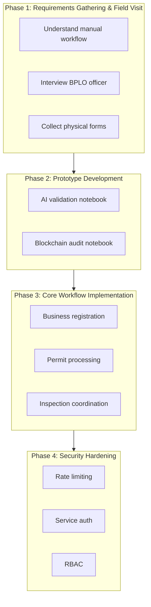

# CHAPTER 1: INTRODUCTION

## Background of the Study

Business permit processing is a fundamental regulatory function of Local Government Units (LGUs) that ensures businesses operate legally, safely, and in compliance with established standards. Efficient permit processing is essential because it directly affects local economic activity, public safety, and public trust in government institutions. When permit systems are slow, fragmented, or poorly monitored, they can discourage entrepreneurship, delay investments, and weaken regulatory enforcement.
With the advancement of digital technologies, governments worldwide have increasingly adopted e-government systems to improve the efficiency, transparency, and accessibility of public services. According to the United Nations E-Government Survey 2024, nations worldwide have accelerated digital government strategies despite global crises, with significant progress driven by investments in resilient infrastructure and technologies including artificial intelligence, cloud computing, and broadband (United Nations Department of Economic and Social Affairs, 2024). The survey, which examined 193 member states, found that Denmark, Estonia, and Singapore topped the 2024 rankings, demonstrating how effective digital transformation can modernize public service delivery.
Research demonstrates that high-quality digital services significantly impact citizen satisfaction and trust in government. However, a 2024 study analyzing 36 OECD member countries found that e-government does not directly improve trust in government but has an indirect effect through governance quality—meaning e-government systems must actively contribute to governance quality to build citizen trust (Sasaki, 2024). This relationship underscores the importance of prioritizing service quality improvements in digital government initiatives to foster healthier relationships between government and citizens.
More recently, Artificial Intelligence (AI) has emerged as a transformative technology capable of further enhancing digital governance. AI has been widely used to automate document validation, detect inconsistencies, and support decision-making in public administration. Research from the Alan Turing Institute demonstrates that AI-powered automation can significantly improve bureaucratic efficiency, with studies showing that 84% of the United Kingdom's 143 million complex government transactions are highly automatable, potentially saving the equivalent of 1,200 person-years of work annually if AI reduces processing time by just one minute per transaction (Bedi et al., 2024). Across U.S. federal agencies, generative AI use cases increased ninefold from 32 cases in 2023 to 282 in 2024, while total AI use cases nearly doubled from 571 to 1,110, demonstrating rapid adoption of AI technologies in government (U.S. Government Accountability Office, 2025). AI deployment in government offers substantial efficiency gains, with agencies using AI for case processing potentially saving up to 35% of budget costs over ten years (Boston Consulting Group, 2025).
Practical implementations have begun to emerge. For instance, the U.S. Department of Health and Human Services deployed an AI system in November 2024 to structure and validate the completeness of case data information, parsing free-form data into searchable formats and highlighting whether required fields are included, with human review teams verifying completeness before final data entry (U.S. Department of Health and Human Services, 2024). The UK Cabinet Office implemented an automated digital document review algorithm in January 2024 to assist in identifying digital records of long-term historic value, sorting large volumes of unorganized legacy digital information using classifications and language pattern matching (UK Cabinet Office, 2024).
Blockchain technology has been recognized for its ability to ensure data integrity, transparency, and tamper-proof recordkeeping. A systematic literature review by Enríquez et al. (2024) identified best-practice blockchain-based governance models specifically focused on corruption and transparency, examining their characteristics, components, and the role of token economies in addressing asset ownership issues. Blockchain's immutable ledger and cryptographic security enable enhanced tracking of government fund allocation while reducing corruption risks (Agyekum et al., 2024). A 2024 survey by Al-Rawy et al. examined the current status and challenges of blockchain implementation in e-government services, surveying existing use cases and identifying research gaps in blockchain deployment across governmental organizations. The European Commission's 2022 analysis of 167 blockchain use cases from European governments found that blockchain adoption by public administrations shows potential to improve effectiveness and efficiency, though implementation requires overcoming significant barriers including lack of large-scale deployment, inter-organizational collaboration challenges, and legal uncertainty (European Commission, 2022).
When combined, AI and blockchain technologies provide stronger benefits than using either technology alone. A 2025 bibliometric analysis by Sana et al. found that while AI and blockchain are separately applied in e-governance, there is a clear gap in empirical studies addressing their combined use. The study identified that AI enables real-time data processing and predictive insights for policy decisions and resource distribution in smart cities, while blockchain provides secure, immutable records of transactions and decisions, enhancing transparency and public trust (Sana et al., 2025). Despite theoretical interest, researchers found insufficient cross-disciplinary collaboration and a significant gap between theoretical frameworks and real-world technology integration, recommending prioritization of longitudinal case studies and pilot projects to address regulatory, ethical, and practical challenges in responsible AI-blockchain adoption for digital governance.
The digitalization of public services involving multiple offices requires effective coordination mechanisms. The European Union established new governance structures through the Interoperable Europe Act (Regulation EU 2024/903), adopted in March 2024, which creates a framework for public sector interoperability across EU member states (European Commission, 2024). The regulation establishes a multi-level governance structure and defines standards for trans-European digital public services to enable seamless cross-border service delivery. This framework demonstrates that the many actors involved in multi-office digital services need centralized coordination to benefit from both decentralized flexibility and centralized efficiency.
In the Philippines, Republic Act No. 11032, also known as the Ease of Doing Business and Efficient Government Service Delivery Act of 2018, mandates maximum processing times for government transactions: 3 working days for simple transactions, 7 working days for complex transactions, and 20 working days for highly technical applications (Republic Act No. 11032, 2018). The law requires LGUs to establish Business One-Stop-Shops (BOSS) and automate their business permitting and licensing systems. The legislation provides for automatic approval if applications are not acted upon within prescribed timeframes, provided the application is complete and fees are paid on time.
As of December 2024, only 838 out of 1,642 LGUs (approximately 51%) have been digitally connected through the eLGU program, with 375 LGUs in Luzon, 238 in the Visayas, and 225 in Mindanao (Department of Information and Communications Technology, 2024). While approximately 60% of LGUs (921 out of 1,634) were automating business permit processing as of December 2023, only 39% accept online applications and merely 15% (222 LGUs) accept online payments (Department of the Interior and Local Government, 2023). Digitalization efforts have contributed to improved revenue collection, increasing from PHP 50 billion in 2018 to PHP 208 billion by late 2023, demonstrating the potential benefits of digital transformation. Processing times have been reduced from three days to minutes, and procedures have been streamlined from 27 steps to approximately three (Philippine News Agency, 2023).
Despite these initiatives, progress remains uneven. A scoping review on digital governance in the Philippines found that while digital governance can improve public service delivery through responsiveness, accessibility, and efficiency, success requires overcoming adoption barriers, financial capability challenges, digital literacy deficiencies, and ICT infrastructure issues (Castillo, 2024). Recent research proposing an integrative smart city framework for Philippine LGUs identified critical gaps including limited research and development investment, lack of standardization, coordination deficiencies, and absence of unified digital platforms, despite established ICT plans and active e-governance initiatives (Castañeda & Dizon, 2024). The proposed framework, which reviewed the ASEAN Smart Cities Network Framework, DOST Smarter City Framework, ISO 37106:2021 guidelines, and the Asian Development Bank smart cities pathway model, emphasized that successful implementation requires national policy support, adoption of standards, local leadership, data infrastructure, and multi-stakeholder partnerships.
Key challenges identified across multiple studies include inadequate digital infrastructure, limited technical expertise, budgetary constraints, lack of citizen engagement, data privacy and security concerns, connectivity gaps particularly affecting remote and rural areas, insufficient systems interoperability, and lack of standardized policies (Digital Watch, 2024). A significant portion of the Philippine population lacks reliable internet connectivity, which is crucial for driving economic growth and digital inclusion.
Research on business permit systems in Philippine cities demonstrates the importance of efficient permit processing. A 2024 study of 390 MSMEs in Iloilo City by Niño and Gentoral found that businesses reported high compliance with BPLS requirements, with very good to excellent business performance ratings. The research revealed a very strong positive relationship between compliance and satisfaction with BPLS, though only a negligible relationship between compliance and actual business performance (Niño & Gentoral, 2024). The study recommended fully implementing electronic BPLS systems as part of ease of doing business initiatives, highlighting the need for digital permit processing solutions that enhance both compliance and business satisfaction. Iloilo City received commendation from the Anti-Red Tape Authority in August 2024 for full compliance with the electronic Business One-Stop Shop (eBOSS) system, with 50% of barangays digitally integrated and business permit renewals increasing by 15% in January 2024 compared to the same period in 2023.
In Alaminos City, Pangasinan, business permit processing involves the Business Permit and Licensing Office (BPLO), Bureau of Fire Protection (BFP), Sanitary Office, Zoning Office, and Engineering Office. The BPLO uses a unified business permit form; business owners fill a single form, and officers encode data into the system. Business activities use PSIC 2019 codes (sections A–U). The Business One-Stop Shop (BOSS) enables a single visit with processing completed in approximately 20 minutes for new permits. Permits expire December 31 each year; renewal is every January. Fees are computed based on business activity type and gross sales or capitalization. Despite these improvements, coordination across offices, inspection scheduling, and record verification remain challenges that a digital system can address.
The current manual workflow in Alaminos City poses significant challenges in terms of efficiency and accountability. Inspection results are recorded separately by different offices, making coordination difficult and slowing down decision-making. Retrieving records for verification or audit purposes is time-consuming, and the absence of a centralized system increases the risk of data inconsistencies and manipulation.
The manual business permit processing system in Alaminos City exhibits several concrete inefficiencies that significantly impact business owners and government operations:

**Multiple Office Visits and Redundant Submissions.** Business owners applying for a new permit must physically visit up to five different offices—BPLO, BFP, Sanitary Office, Zoning Office, and Engineering Office—often on separate days. Applicants are required to provide duplicate copies of the same documents such as DTI/SEC registration, barangay clearance, and lease contracts to each office, resulting in unnecessary paperwork and increased expenses for photocopying and transportation.

**Sequential Processing Bottlenecks.** The sequential nature of the approval process creates substantial delays when deficiencies are discovered at later stages. For instance, if the Zoning Office finds an incomplete land use requirement after inspections have already been conducted by the BFP and Sanitary Office, applicants must return to the BPLO to resubmit corrected documents and then revisit all subsequent offices to repeat their inspections. This extends what should be a seven-day process under RA 11032 to three to four weeks or longer.

**Uncoordinated Inspection Scheduling.** Inspections are scheduled independently by each office without coordination. Business owners must be available on multiple unpredictable dates for BFP fire safety inspection, Sanitary health inspection, and Engineering structural inspection. This lack of coordination can disrupt business operations, particularly for small enterprises with limited staff, and demands repeated coordination efforts by applicants who must contact each office separately to confirm schedules.

**Paper-Based Recordkeeping Vulnerabilities.** All permit applications, inspection reports, and compliance records are maintained in physical files stored separately by each office. This makes it extremely difficult to locate historical compliance records when needed for audits, permit renewals, or verification purposes. Physical documents are susceptible to loss, damage from environmental factors, or unauthorized alteration. There is no systematic backup mechanism, and reconstruction of lost records is often impossible.

**Limited Application Status Visibility.** Business owners have no centralized system to track the progress of their applications. To determine their permit status, they must call or physically visit each office individually—BPLO to check initial document review status, BFP to confirm fire inspection scheduling, Sanitary Office to verify health inspection completion, Zoning Office to check land use clearance, and Engineering Office to confirm structural compliance. This wastes considerable time for both applicants and government staff who must repeatedly respond to status inquiries.
Despite existing efforts, significant gaps remain in business permit processing systems. Current challenges include manual document submission, repetitive requirements, delayed inspections, poor inter-office coordination, and weak record security. These limitations increase the risk of lost or altered records, reduce transparency, and make it difficult for LGUs to track compliance histories accurately. The reviewed studies indicate a lack of empirical implementations that combine AI-assisted validation and blockchain-based security in local-level permit systems, particularly in developing country settings (Sana et al., 2025).
## Conceptual Framework

This study adopts the Input–Process–Output (IPO) framework, which is appropriate for system development research as it illustrates how identified inputs are transformed through defined processes into desired outputs.

- **Input.** The inputs of the study include the existing manual business permit processes, identified problems such as delays and fragmented inspections, user requirements from LGU personnel, and the proposed system features including AI-assisted document validation and blockchain-based record security.
- **Process.** The process involves requirements gathering and workflow analysis, system design and development using a Kanban–XP hybrid agile methodology, implementation of AI-based document validation, integration of digital inspection workflows, blockchain hashing and recording of permit and inspection data, and system testing and evaluation.
- **Output.** The expected output is a fully developed digital business permit processing and inspection tracking system. The system is expected to produce faster permit processing, improved document accuracy, secure and tamper-proof records, and enhanced monitoring and reporting capabilities for LGUs.

*Figure 1.1 presents the Input–Process–Output (IPO) framework of the BizClear system.*

## Statement of the Problem

Business permit processing in Alaminos City is currently characterized by manual procedures, fragmented inspection workflows, and limited record security. These conditions result in processing delays, incomplete submissions, difficulty in monitoring compliance, and reduced transparency among involved LGU offices. There is a need for a unified digital system that streamlines permit processing, improves document validation, and ensures the integrity of official records.

Specifically, this study seeks to answer the following questions:

1. How can a digital business permit processing system improve the efficiency and accessibility of permit application and renewal in Alaminos City?
2. How can AI-assisted document validation reduce incomplete submissions and inconsistencies in business permit requirements?
3. How can blockchain technology enhance the integrity, transparency, and accountability of business permit and inspection records?
4. How feasible and acceptable is the proposed BizClear system to business owners and LGU personnel?

Given the system development nature of the study, formal research hypotheses are not applicable.

## Statement of Objectives

The general objective of this study is to design and develop BizClear, a blockchain-enhanced business permit processing and inspection tracking system with AI-assisted document validation for Alaminos City.

Specifically, it aims to answer the following questions:

1. Design and implement a digital business permit processing platform with centralized inspection workflow for BPLO, BFP, Sanitary, Zoning, and Engineering offices to improve efficiency and accessibility of permit application and renewal in Alaminos City.
2. Develop an AI-assisted document validation mechanism to automatically check document completeness and detect inconsistencies in business permit requirements.
3. Implement blockchain technology to secure permit and inspection records and ensure data integrity, transparency, and accountability.
4. Evaluate the feasibility, usability, and acceptability of the BizClear system among business owners and LGU personnel.

The BizClear system is expected to significantly improve business permit processing in Alaminos City through these measurable performance improvements:

- **Processing Time Reduction.** Based on field visit findings at the Alaminos City BPLO, permit processing takes approximately 20 minutes for new permits when using the unified form and integrated system. The BizClear system aims to match or improve upon this through digital submission and AI-assisted validation.
- **Document Accuracy Improvement.** The rate of document rejections or returns due to incomplete or inconsistent submissions is anticipated to drop from the current 30–40% to 10% or less through AI-assisted validation that checks completeness and detects inconsistencies before submission.
- **Office Visit Reduction.** Based on field visit findings, the BPLO Business One-Stop Shop (BOSS) enables a single visit for permit processing. The BizClear system aims to maintain or improve upon this through digital submission and centralized processing, significantly reducing applicant burden and transportation costs.
- **Inspection Coordination Efficiency.** Inspection coordination across offices (BFP, Sanitary, Zoning, Engineering) is expected to shorten from the current 10–14 days to 5 days or less through automated scheduling and inter-office coordination mechanisms.
- **Record Retrieval Speed.** Record retrieval time for audits, renewals, and verification purposes should improve from the current 30–60 minutes per record (involving physical file searches across multiple offices) to 2 minutes or less through centralized digital records with blockchain-secured audit trails.
- **Application Status Transparency.** The system will provide real-time tracking of application status through online dashboards, replacing the current manual inquiry process that requires multiple phone calls or office visits to different offices.
- **User Satisfaction Target.** The system is expected to achieve an applicant satisfaction rating of 4.0 out of 5.0 or higher, measured through post-transaction surveys evaluating system usability, processing speed, transparency, and overall experience.

## Significance of the Study

**To The Business Owners and Entrepreneurs.** The proposed system will significantly benefit business owners and entrepreneurs by reducing processing time, minimizing repeated document submissions, and providing real-time updates on permit and inspection status, thereby improving overall ease of doing business. As primary end-users of the system, business owners will experience streamlined processes and enhanced transparency throughout the permit application lifecycle. They will be able to submit business permit applications and required documents through the online digital platform, eliminating the need for multiple physical office visits. Supporting documents such as DTI/SEC registration, barangay clearance, and lease contracts can be uploaded in digital format, reducing paperwork and photocopying expenses. The system will enable them to respond promptly to AI-generated deficiency notices by uploading corrected or missing documents, significantly reducing processing delays. Business owners will also be able to confirm inspection schedules coordinated by the system across multiple offices, track application status in real-time through the applicant dashboard, and receive digital permits and compliance certificates upon approval. Additionally, they will have convenient access to historical permit and inspection records for renewals and compliance verification, eliminating the need to search through physical files or make repeated inquiries to government offices.

**To The Business Permit and Licensing Office (BPLO).** The BPLO will benefit substantially from a streamlined and centralized workflow that reduces manual workload, improves tracking of applications, and enhances decision-making efficiency through data-driven insights. BPLO staff will be empowered to review and verify submitted applications processed through the digital platform with greater efficiency and accuracy. They will be able to coordinate seamlessly with other offices including BFP, Sanitary, Zoning, and Engineering through the centralized system, eliminating communication delays and coordination challenges. The AI validation recommendations will assist staff in managing document requirement verification more effectively, reducing the time spent on manual checking. Staff will process approvals and issue digital permits upon completion of all requirements, generate compliance reports, processing time analytics, and performance dashboards to monitor office productivity, and respond to applicant inquiries using real-time status information from the system. They will also be able to monitor workflow bottlenecks and flag applications requiring special attention for timely intervention. The BPLO Head will have enhanced oversight capabilities, providing final approval for business permit applications through the system while monitoring overall workflow efficiency and office performance metrics. The Head will be able to monitor staff performance through system-generated analytics and processing time reports, ensure compliance with Republic Act 11032 processing time standards, review and approve policy adjustments based on system data and feedback, and coordinate inter-office operations while resolving escalated issues through data-driven insights.

**To Other LGU Offices (BFP, Sanitary, Zoning, Engineering).** The Bureau of Fire Protection, Sanitary Office, Zoning Office, and Engineering Office will benefit from coordinated digital inspections, shared access to application records, and improved compliance monitoring through centralized data management. Inspectors and officers from these offices will be able to access assigned inspection cases through the digital platform with complete application information readily available, eliminating the need to request documents from other offices or applicants. They will conduct inspections within their respective domains—fire safety, health standards, zoning compliance, and structural integrity—and submit digital inspection results, findings, and recommendations through the system in real-time. The platform will enable them to flag deficiencies or non-compliance issues with specific documentation and photographic evidence, providing clear audit trails for regulatory enforcement. Upon successful inspection completion, they will issue clearances digitally, reducing paperwork and accelerating the overall permit approval process. The centralized calendar system will allow them to coordinate inspection schedules to minimize business disruption, particularly beneficial for applicants operating existing businesses. They will also have access to historical inspection records for renewal applications and compliance verification, enabling more informed decision-making and consistent enforcement of fire safety regulations, health standards, zoning ordinances, and structural building codes.

**To Local Government Unit (LGU) Administrators and Policymakers.** LGU administrators and policymakers will gain access to reliable data, comprehensive dashboards, and secure records that support transparent governance and data-driven policy decisions for continuous improvement of local business regulations. They will be able to monitor LGU-wide permit statistics including application volumes, processing times, approval rates, and rejection reasons, providing critical insights into regulatory bottlenecks and operational efficiency. The system will enable them to evaluate compliance with national standards mandated by Republic Act 11032 and identify areas requiring intervention or resource allocation. Access to blockchain-secured audit trails will provide unprecedented transparency and accountability verification, strengthening public trust in government operations. Administrators will be able to use system-generated insights to inform policy development and operational efficiency improvements, ensuring evidence-based decision-making rather than relying on anecdotal information. They can review revenue collection data linked to permit issuance for fiscal planning and budget forecasting, assess inter-office coordination effectiveness and resource allocation needs to optimize staffing and workflows, and support strategic planning for business development and investment promotion initiatives by understanding permit application trends and business sector growth patterns.

**To The Researchers.** The researchers will gain valuable experience in system development, project management, and the integration of emerging technologies such as artificial intelligence and blockchain in public sector applications. This hands-on experience in developing a real-world e-governance solution will contribute significantly to their professional development and technical expertise. They will acquire practical skills in requirements analysis, agile software development methodology, AI implementation for document validation, blockchain integration for data security, user interface design for government applications, and system testing and evaluation. The project will also develop their capabilities in stakeholder engagement, interdisciplinary collaboration, and addressing complex socio-technical challenges in digital government transformation, preparing them for careers in technology innovation, public sector consulting, or further academic research in digital governance.

**To Future Researchers.** The study will serve as a comprehensive reference for future research projects examining the integration of artificial intelligence and blockchain technologies in e-governance applications. It will provide valuable empirical evidence addressing the identified research gap in combined AI-blockchain implementations for local-level government services, particularly in the context of business permit processing systems in developing country settings. Future researchers will benefit from the documented system architecture, implementation methodology, evaluation framework, lessons learned, and challenges encountered during the project. The study will contribute to the growing body of knowledge on digital government transformation in Philippine Local Government Units, offering insights into technical feasibility, organizational readiness, user acceptance, and policy implications of emerging technology adoption. Researchers investigating public service delivery improvement, smart city initiatives, regulatory efficiency, or blockchain applications in government will find relevant frameworks, methodologies, and findings that can inform their own investigations and advance the field of digital governance research.

**To Future Developers.** Future developers will benefit significantly from the system architecture, implementation approaches, and lessons learned documented in this study. The detailed documentation will provide practical insights for developing similar digital government platforms that combine AI-assisted validation, blockchain-secured records, and multi-office coordination mechanisms. Developers working on government digitalization projects will find valuable guidance on integrating emerging technologies within existing bureaucratic structures, designing user interfaces for diverse stakeholder groups with varying levels of digital literacy, implementing role-based access control for multi-office government systems, ensuring data security and privacy in public sector applications, and balancing automation with human oversight in regulatory decision-making. The open documentation of technical challenges, solutions, and best practices will accelerate the development of comparable systems in other LGUs and government agencies, contributing to broader digital transformation efforts and reducing duplication of effort across the public sector.

## Scope and Limitations

This study covers the design and development of a digital business permit processing and inspection tracking system for Alaminos City. The system will serve business owners and LGU offices involved in permit processing, including the Business Permit and Licensing Office (BPLO), Bureau of Fire Protection (BFP), Sanitary Office, Zoning Office, and Engineering Office.

**Limitations:**

- **Geographic Scope.** The study is limited to a pilot implementation within Alaminos City and will not extend to other municipalities or cities in Pangasinan or other provinces.
- **Decision Authority.** The system will focus on permit processing and inspection tracking but will not automate final approval decisions, which will remain under human authority and discretion of authorized LGU officials.
- **National System Integration.** The system will not integrate with national government databases or systems due to complexity and authorization requirements.

**Explicit Exclusions:**

The following are explicitly outside the scope of this study:

- **National System Integration.** No integration with national government databases including Bureau of Internal Revenue (BIR), Securities and Exchange Commission (SEC), Department of Trade and Industry (DTI), or Philippine Identification System (PhilSys) due to technical complexity, inter-agency authorization requirements, and data sharing policy constraints.
- **Payment Processing.** Fee computation and payment collection will continue through existing LGU payment systems and treasury processes. The system will only track payment status and confirmation, not process actual financial transactions.
- **Special Permits.** Specialized permits beyond standard business permits are excluded, including environmental compliance certificates (ECCs), special event permits, liquor licenses, billboard permits, and other specialized regulatory authorizations that require separate approval processes.
- **Legacy Data Migration.** Historical paper records and previously issued permits processed under the manual system will not be digitized or migrated into the new system. Only new applications processed through BizClear from the implementation date forward will be recorded digitally. Historical records will continue to be maintained in their current physical format.
- **Third-Party System Integrations.** Integration with private sector systems such as commercial banks for payment verification, private inspection companies, insurance providers, or other external service providers is not included.
- **Multi-Language Support.** The system will be developed in English and Filipino only. Support for other local languages or dialects is not included in this phase.

---

# CHAPTER 2: METHODOLOGY

## Research Design

This study uses a qualitative descriptive research design. This section introduces that design and explains why it was chosen.

This study addresses the problem of manual, fragmented, and insecure business permit processing in Alaminos City—specifically, inefficiencies in multiple office visits, sequential processing bottlenecks, uncoordinated inspection scheduling, paper-based recordkeeping vulnerabilities, and limited application status visibility. The evidence that demonstrates the success of this study includes: (1) a functional digital permit processing platform with centralized inspection workflow; (2) AI-assisted document validation that reduces incomplete submissions; (3) blockchain-secured audit trails for tamper-proof records; and (4) evaluation of feasibility, usability, and acceptability among stakeholders. The study operated under constraints including a limited budget for development and deployment, a fixed timeline for completion within the academic capstone period, and security measures required for handling sensitive applicant data and LGU records.

This study employs qualitative descriptive research. Qualitative research is characterized by the collection and analysis of non-numerical data to understand concepts, experiences, or opinions in depth (Creswell & Poth, 2018). Descriptive research aims to describe the characteristics of a population or phenomenon being studied. Given the system development nature of the project and the limited number of key respondents (fewer than 10), a qualitative approach was appropriate to capture the lived experiences and requirements of BPLO personnel and business owners. Quantitative research typically requires a larger sample size to achieve statistical significance; qualitative research, by contrast, prioritizes depth over breadth and is suitable when the goal is to understand stakeholder needs, validate workflows, and gather domain expertise from immediate users (Creswell & Poth, 2018).

The key respondents were Wilfredo Villena, BPLO officer at Alaminos City; a business owner (operating in Alaminos City); and the assistant of the mayor. Each was identified as an immediate user or stakeholder: the BPLO officer is responsible for daily permit processing; the business owner has direct experience as an applicant for permits; and the mayor's assistant provides insight into administrative oversight and policy coordination. With fewer than 10 respondents, the qualitative approach prioritized depth over breadth. The qualitative descriptive design was chosen because it allowed the researchers to obtain rich, contextual information from informants whose direct experience with the manual system, applicant perspective, and administrative context made them representative of the target user population for the proposed BizClear system.

## Software Development Methodology

Software development methodology (SDM) refers to the framework or process used to plan, structure, and control the development of an information system. Choosing an appropriate SDM is critical to project success, as it determines how requirements are gathered, how work is organized, and how deliverables are produced and validated.

Several software development methodologies are available. The Waterfall model follows a linear, sequential approach where each phase (requirements, design, implementation, testing, deployment) is completed before the next begins; it is suited to projects with stable, well-defined requirements (Sommerville, 2016). The Spiral model combines elements of iterative development with risk analysis, cycling through planning, risk analysis, engineering, and evaluation. Agile methodologies, by contrast, emphasize iterative development, frequent delivery of working software, close collaboration with stakeholders, and responsiveness to change (Scrum Alliance, 2020). Among agile approaches, Scrum uses time-boxed sprints and defined roles (Product Owner, Scrum Master, Development Team); Kanban focuses on continuous flow and visualization of work-in-progress; and Extreme Programming (XP) emphasizes technical practices such as test-driven development, pair programming, and continuous integration (Beck, 2000).

The study used an agile methodology combining elements of Kanban and Extreme Programming (XP), suited to rapid iteration and close stakeholder feedback. Kanban was adopted for visual workflow management and continuous delivery without fixed sprints, while XP practices informed the technical implementation including modular architecture, automated testing, and incremental feature delivery. This hybrid approach was best suited to the study because: (1) requirements evolved as the researchers learned more from the BPLO officer during the field visit; (2) the system development nature of the project required frequent demos and validation of working prototypes; (3) integration of AI and blockchain components benefited from iterative refinement; and (4) the limited timeline and team size favored a lightweight, flexible process over a rigid phased approach.

Figure 2.1 presents the development phases used in this study.

*Figure 2.1. Development phases (Kanban + XP hybrid)*

**Phase 1: Requirements Gathering and Field Visit.** Requirements gathering is the process of identifying and documenting stakeholder needs, constraints, and acceptance criteria for a system. In this phase, the researchers conducted a field visit to Alaminos City BPLO to understand the manual business permit workflow. The researchers interviewed BPLO officer Wilfredo Villena using a semi-structured questionnaire to validate workflow steps, identify common applicant errors, and confirm fee computation rules. Physical forms were collected and analyzed, including the unified business permit form, general permit form, retirement application form, occupational permit form, ARTA monitoring form, citizens charter, and post-requirements lists. The observations were documented using an observation form at the Business One-Stop Shop (BOSS), recording place, date, and checklist items. Deliverables from this phase included validated workflow diagrams, fee computation rules, and a list of form fields and requirements.

**Phase 2: Prototype Development.** Prototype development involves building early, working versions of key system components to validate technical feasibility and gather stakeholder feedback. In this phase, the researchers developed two Jupyter notebooks: (1) an AI document validation prototype combining rule-based validation, traditional ML (six algorithms: SVM, RF, DT, LR, XGB, NN), and Gemini generative AI for semantic validation; and (2) a blockchain audit prototype with Gradio UI for logging and verifying audit hashes on Ganache. The BPLO officer was consulted to validate prompts, datasets, and workflow alignment. Deliverables from this phase included the AI validation notebook with Gradio UI and the blockchain audit notebook with Gradio UI.

**Phase 3: Core Workflow Implementation.** Implementation is the phase where the full system is built according to the designed architecture. In this phase, the researchers implemented the core BizClear platform including business registration, permit application and renewal workflows, inspection coordination across BPLO, BFP, Sanitary, Zoning, and Engineering offices, fee computation with late penalties (25% surcharge, 2% monthly interest), and integration with the audit-service for blockchain logging. The system was built using React/Vite for the frontend, Node.js/Express microservices for the backend, MongoDB for persistence, and Ganache for blockchain audit trails. Deliverables from this phase included a functional web application with role-based dashboards for business owners, BPLO staff, inspectors, and administrators.

**Phase 4: Security Hardening.** Security hardening involves strengthening the system against unauthorized access, abuse, and data breaches. In this phase, the researchers implemented rate limiting (e.g., 20 logs/min for audit-service), service-to-service authentication using X-API-Key for inter-service calls, role-based access control (RBAC) for user permissions, input sanitization to prevent injection attacks, and least-privilege audit history so that non-admin users see only their own logs. Deliverables from this phase included a security-hardened system ready for evaluation.

## Scope and Delimitation

**Scope.** The BizClear system covers the following features: permit processing (new, renewal, amendment); AI document validation (traditional ML and Gemini generative AI); blockchain audit trail for tamper-proof record verification; inspections (joint, follow-up, complaint-driven) with coordinated scheduling; renewals with fee computation and late penalties; business retirement and cessation; occupational permits; general permits (cooperative, firecrackers, bazaar vendors, etc.); post-requirements tracking (sanitary, fire safety, zoning); role-based dashboards for business owners, BPLO staff, inspectors, and administrators; and centralized inspection workflow across BFP, Sanitary, Zoning, and Engineering offices. Descriptions of each feature are provided in Chapter 3.

**Delimitation.** The system does not integrate with national databases (BIR, SEC, DTI, PhilSys) due to technical complexity and inter-agency authorization requirements. It does not process actual payments; fee computation and payment tracking only. Special permits (ECC, liquor, billboard) are excluded. Legacy data migration from historical paper records is not included. Third-party integrations (banks, private inspection companies, insurance providers) are not included. The system is limited to English and Filipino. Multi-language support for other local languages or dialects is not included in this phase.

## Data Gathering Techniques

Data gathering techniques are the methods used to collect information from various sources to support research objectives. This study employed interview, observation, and document analysis. Each technique is defined below, followed by how it was applied. The results and findings from these techniques are presented in the Sources of Data section.

**Interview.** An interview is a qualitative data collection method in which a researcher asks a respondent questions to gain in-depth information about their experiences, opinions, or knowledge (Kvale & Brinkmann, 2018). Semi-structured interviews were conducted with three respondents: (1) Wilfredo Villena, BPLO officer at Alaminos City, interviewed in person at the BPLO office during the field visit; (2) a business owner operating in Alaminos City (interviewed to capture the applicant perspective); and (3) the assistant of the mayor of Alaminos City (interviewed to capture administrative oversight and policy coordination). The researchers prepared a set of interview questions tailored to each respondent's role—covering workflow steps, common applicant errors, fee computation rules, and document requirements for the BPLO officer; applicant experience, pain points, and expectations for the business owner; and policy priorities and coordination needs for the mayor's assistant. All three were identified as immediate users or stakeholders with direct involvement in or knowledge of permit processing. The interviews validated workflow steps, identified common applicant errors (e.g., missing barangay clearance, incorrect tax code), confirmed fee computation rules including the 25% surcharge and 2% monthly interest for late renewals, and gathered insights on applicant needs and administrative priorities. The interview questions and respondent information are included in the appendices.

**Interview.** An interview is a qualitative data collection method in which a researcher asks a respondent questions to gain in-depth information about their experiences, opinions, or knowledge (Kvale & Brinkmann, 2018). Semi-structured interviews were conducted with three respondents: (1) Wilfredo Villena, BPLO officer at Alaminos City, interviewed in person at the BPLO office during the field visit; (2) a business owner operating in Alaminos City; and (3) the assistant of the mayor of Alaminos City. The researchers prepared a set of interview questions tailored to each respondent's role. All three were identified as immediate users or stakeholders with direct involvement in or knowledge of permit processing. The interview questions and respondent information are included in the appendices.

**Observation.** Observation is a data collection method in which the researcher systematically watches and records behaviors, events, or processes in their natural setting (Angrosino, 2007). Observations were conducted at the Business One-Stop Shop (BOSS) in Alaminos City. The researchers used an observation form with a checklist of items including: applicant arrival and document submission, BPLO encoding process, coordination with other offices, inspection scheduling, and issuance of permits. The form recorded place (Alaminos City BOSS), date of visit, and environmental or procedural notes. The observation form used (without answers) is included in the appendices.

**Document Analysis.** Document analysis is the systematic review and evaluation of documents to extract relevant information for research purposes (Bowen, 2009). Physical forms were collected and analyzed, including the unified business permit form, general permit form, retirement application form, occupational permit form, ARTA monitoring form, citizens charter, and post-requirements lists. The researchers reviewed these documents to extract information relevant to form design, validation rules, and system requirements. The physical copies of the forms are referenced in the appendices.

## Sources of Data

Whereas the Data Gathering Techniques section explained how data were collected (the process), this section presents the data gathered—the results and findings obtained from each technique. The interview questionnaires and sample responses are included in the Appendices below.

**Primary sources.** Primary sources are firsthand accounts or original data collected directly by the researcher. The findings from the interviews and observation are discussed in detail below.

*Findings from the interview with Wilfredo Villena, BPLO officer.* The officer validated the complete workflow: applicants fill the unified form at BPLO and submit required documents (barangay clearance, CTC, DTI/SEC, lease contract); BPLO encodes data and forwards to BFP, Sanitary, Zoning, and Engineering depending on business type; each office schedules inspections jointly; fee is computed from tax code, business activity, and gross sales or capitalization; applicant pays at treasury and permit is issued. The officer reported that BPLO encoding takes approximately 20 minutes when documents are complete, but the full process—including inspections—extends to 2–4 weeks or longer, despite RA 11032's 7-day standard for complex transactions. For late renewal, the officer confirmed a 25% surcharge plus 2% monthly interest. Pre-requirements are: (a) CTC, (b) Barangay Clearance, (c) PIS, (d) DTI or SEC. The most common applicant errors are: missing or expired barangay clearance (most frequent); wrong tax code or line of business mismatch; incomplete address; and missing pre-requirements. The officer estimated 30–40% of applications are returned or require multiple submissions. Inspection coordination is done manually—no shared system; each office keeps separate records; applicants must visit each office. Record retrieval for audits or renewals involves searching physical files across offices. The officer expressed that a digital system with real-time status, shared inspection coordination, and searchable records would significantly improve efficiency.

*Findings from the interview with the business owner.* The business owner reported applying for new permits and renewing annually. For new permits, the process required 5–6 separate visits to BPLO, Barangay, BFP, Sanitary, and Zoning over approximately 3 weeks. The same documents (DTI registration, barangay clearance, lease contract) were submitted in multiple copies to different offices. The most frustrating aspects were: lack of status visibility—not knowing which office had the application or when inspection would be scheduled; having to call or visit repeatedly to ask; and applications returned for deficiencies (e.g., expired barangay clearance, tax code–line of business mismatch) requiring additional visits. The business owner estimated spending roughly PHP 500–800 on transportation, PHP 200–300 on photocopying, and 3–4 days of lost work time. For a digital system, the business owner expected: online submission of forms and documents; real-time status tracking; notifications when action is needed or inspection is scheduled; coordinated inspections (single or fewer appointments); and digital permit issuance. The business owner reported having internet access and willingness to use an online system. For late renewal, the surcharge and interest were confirmed; the business owner suggested online fee computation and reminders before permit expiry. Overall satisfaction with the current process was rated 2–3 out of 5.

*Findings from the interview with the assistant of the mayor.* The respondent provided insight into administrative priorities: permit processing efficiency as a key concern for ease of doing business; need for oversight and coordination across BFP, Sanitary, Zoning, and Engineering; and policy considerations for transparency and accountability in permit issuance. The data informed the design of administrator dashboards and reporting features in BizClear.

*Findings from the observation at the Business One-Stop Shop.* The researchers documented: the physical layout of the BOSS; the flow of documents from applicant to BPLO and onward to other offices; how applicants interact with officers during submission; and how coordination among offices occurs (phone calls, manual handoff). The observation confirmed the absence of a centralized digital system and the reliance on paper-based workflows.

**Secondary sources.** Secondary sources are pre-existing materials. The data gathered from documents and related literature include: processing time standards (3/7/20 working days) and BOSS requirements from RA 11032; LGU authority over business permits from RA 7160; business activity codes and classification structure from PSIC 2019; BPLS streamlining guidelines from DILG; citizen's charter and monitoring templates from ARTA; and from RRL—evidence on AI in government document validation, blockchain for e-governance audit trails, and digital permit system best practices. These data informed the system design, validation rules (including tax code–line of business cascading), fee computation logic, and compliance requirements implemented in BizClear.

---

## Appendices

### Appendix A: Interview Questionnaire for BPLO Officer

**Respondent:** Wilfredo Villena | **Position:** BPLO Officer | **Office:** BPLO, Alaminos City, Pangasinan | **Place:** BPLO Office, Alaminos City Hall

| # | Question | Sample Response |
|---|----------|-----------------|
| 1 | Can you describe the step-by-step process when a business owner applies for a new business permit? | Applicant fills unified form at BPLO, submits required documents (barangay clearance, CTC, DTI/SEC, lease contract). BPLO encodes, forwards to BFP/Sanitary/Zoning/Engineering per business type. Each office schedules inspection. Fee computed from tax code, activity, gross sales/capitalization. Applicant pays at treasury, permit issued. |
| 2 | How long does the typical new permit process take? | BPLO encoding ~20 min when complete. Full process with inspections: 2–4 weeks or longer. RA 11032 says 7 days for complex; in practice longer due to inspections. |
| 3 | What is the workflow for permit renewal? | Renewal every January. Submit renewal form, updated gross sales. Late renewal: 25% surcharge + 2% monthly interest. |
| 4 | How do you coordinate with BFP, Sanitary, Zoning, Engineering? | No shared system. Applicant visits each office. Each office keeps separate records. Manual coordination. |
| 5 | What are the most common errors in applications? | Missing barangay clearance (most common); wrong tax code or line of business mismatch; incomplete address; missing pre-requirements. |
| 6 | What percentage of applications are returned? | 30–40%. Many come back 2–3 times. |
| 7 | What are the exact penalties for late renewal? | 25% surcharge on base fee; 2% monthly interest per month of delay. |
| 8 | What are the required pre-requirements? | (a) CTC, (b) Barangay Clearance, (c) PIS, (d) DTI or SEC. Lease contract if rented. |
| 9 | What tax codes does Alaminos use? | LGU-specific: A, B, C, C-D, D, E, F, G, H, I, J, K, L, M, N, S. Each has linked lines of business. |

### Appendix B: Interview Questionnaire for Business Owner

**Respondent:** [Business owner, Alaminos City] | **Place:** [Location]

| # | Question | Sample Response |
|---|----------|-----------------|
| 1 | Describe your experience applying for or renewing a permit. | New permit: visited BPLO, Barangay, BFP, Sanitary, Zoning. Each office different schedule. ~3 weeks total. Renewal: simpler, BPLO and treasury. |
| 2 | How many offices did you visit, on how many days? | New permit: 5–6 visits. Renewal: 1–2 visits. |
| 3 | Did you submit the same documents to multiple offices? | Yes. Multiple copies of DTI, barangay clearance, lease contract. Significant photocopying cost. |
| 4 | What was the most frustrating part? | Not knowing status. Had to call or visit to ask. When deficiencies found, had to return. |
| 5 | Were you ever returned or rejected? Why? | Yes. Expired barangay clearance; tax code–line of business mismatch. |
| 6 | How much time and money did you spend? | Transport ~PHP 500–800; photocopying ~PHP 200–300; 3–4 days lost work. |
| 7 | Would you use an online system? | Yes. Upload documents, see status online, get notifications. |
| 8 | What features would be most valuable? | Online submission; real-time status; notifications; coordinated inspections; digital permit. |
| 9 | Overall satisfaction with current process (1–5)? | 2–3. Works but tedious. |

### Appendix C: Observation Form (BOSS)

**Place:** Alaminos City Hall, BOSS | **Date:** _______________ | **Observer:** _______________

| Item | ✓ |
|------|---|
| Applicant arrival and document submission | |
| BPLO encoding process | |
| Document flow to other offices | |
| Coordination with BFP, Sanitary, Zoning, Engineering | |
| Inspection scheduling procedure | |
| Fee computation and payment | |
| Permit issuance | |

*Notes:*

_______________________________________________________________________________

### Appendix D: Physical Forms Analyzed

Unified business permit form, general permit form, retirement application form, occupational permit form, ARTA monitoring form, citizens charter, post-requirements lists. (Add photos or scans when available.)

---

Definition of Terms
Artificial Intelligence (AI). In this study, AI refers to the system component used to automatically validate document completeness and detect inconsistencies in submitted business permit requirements through pattern recognition and rule-based checking algorithms.
BizClear System. The proposed blockchain-enhanced business permit processing and inspection tracking platform with AI-assisted document validation developed in this study for Alaminos City.
Blockchain. A distributed ledger technology used in the study to store cryptographic hashes of permit and inspection records to ensure data integrity, immutability, and tamper-proof verification.
Business One-Stop-Shop (BOSS).  A centralized location or online portal mandated by RA 11032 where LGUs receive and process business permit applications, receive payments, and issue licenses, clearances, permits, and authorizations.
Business Permit. An official authorization issued by the LGU allowing a business to operate legally, processed digitally through the BizClear system, also known as Mayor's Permit.
Business Permit and Licensing Office (BPLO). The LGU office responsible for processing and approving business permits using the proposed system, also known as Business Permit and Licensing Section (BPLS).
Centralized Inspection Workflow. The coordinated digital process enabled by the BizClear system where inspections from multiple offices (BFP, Sanitary, Zoning, Engineering) are scheduled, conducted, and recorded through a unified platform, reducing redundancy and coordination time.
Document Validation. The automated checking of submitted documents for completeness, consistency, and compliance with requirements using AI algorithms that flag missing information or inconsistencies before documents reach human reviewers.
Ease of Doing Business and Efficient Government Service Delivery Act (RA 11032). Philippine legislation enacted in 2018 that mandates maximum processing times for government transactions and requires LGUs to establish Business One-Stop-Shops and automate business permitting systems.
eLGU System. The electronic Local Government Unit system, a government initiative providing online access to local government services including business permit licensing, implemented in partnership with DICT, DILG, and ARTA.

Immutability. The property of blockchain records that prevents unauthorized modification of stored data, ensuring that once permit or inspection records are written, they cannot be altered or deleted without detection.
Inspection Log. A digital record of inspection results from various LGU offices (BFP, Sanitary, Zoning, Engineering) stored and secured by the system, containing inspection findings, compliance status, deficiency notes, and clearance issuance.
LGU Dashboard. A system interface that displays real-time permit status, inspection progress, processing times, compliance metrics, and performance analytics for monitoring by administrators and policymakers.
Permit Processing Time. The duration from permit application submission to final approval and issuance, measured in working days to evaluate system efficiency and compliance with RA 11032 standards (7 working days for complex transactions).
Role-Based Access Control (RBAC). A security mechanism that restricts system access and functionality based on user roles (business owner, BPLO staff, inspector, administrator), ensuring appropriate access to sensitive information and functions.
Kanban–XP Hybrid. The agile software development approach used in the study, combining Kanban (visual workflow, continuous delivery) and Extreme Programming (XP) practices (test-driven development, modular architecture) for iterative development and stakeholder feedback.
Smart Inspection Workflow. The coordinated digital process of scheduling, conducting, and recording inspections across offices, utilizing automated notifications, shared calendars, and centralized documentation to improve efficiency.
Tamper-Proof Record. A record secured using blockchain cryptographic hashing to prevent undetected modification, providing verifiable audit trails for permit applications, inspection results, and approval decisions.
Transparency. The ability of stakeholders to view and verify permit and inspection status in real time through the system, supporting accountability and reducing information asymmetry between applicants and government offices.

REFERENCES
Angrosino, M. (2007). Doing ethnographic and observational research. SAGE.
Beck, K. (2000). Extreme programming explained: Embrace change. Addison-Wesley.
Bowen, G. A. (2009). Document analysis as a qualitative research method. Qualitative Research Journal, 9(2), 27–40. https://doi.org/10.3316/QRJ0902027
Creswell, J. W., & Creswell, J. D. (2018). Research design: Qualitative, quantitative, and mixed methods approaches (5th ed.). SAGE.
Creswell, J. W., & Poth, C. N. (2018). Qualitative inquiry and research design: Choosing among five approaches (4th ed.). SAGE.
Kvale, S., & Brinkmann, S. (2018). Doing interviews (2nd ed.). SAGE.
Scrum Alliance. (2020). Scrum guide. https://scrumalliance.org/
Sommerville, I. (2016). Software engineering (10th ed.). Pearson.
Agyekum, K. O.-B. O., Botchway, R. K., & King, R. S. (2024). Blockchain-based system for enhancing transparency and accountability in government fund allocation. Propulsion Technology Journal, 1(1), Article 6888. https://doi.org/10.5281/zenodo.10558888
Al-Rawy, A., Salih, A., & Aljuboori, A. F. (2024). Blockchain in e-government services: Current status, challenges, and future directions. arXiv preprint arXiv:2402.02483. https://arxiv.org/abs/2402.02483
Bedi, S., Mateen, B., Trillo, C., & Bright, J. (2024). AI for bureaucratic productivity: Measuring the potential of AI to help automate 143 million UK government transactions. arXiv preprint arXiv:2403.14712. The Alan Turing Institute. https://arxiv.org/html/2403.14712v1
Boston Consulting Group. (2025). How AI can cut through bureaucracy, boost efficiency, and build trust in government. https://www.bcg.com/publications/2025/benefits-of-ai-in-government
Castañeda, J. P., & Dizon, E. M. (2024). Developing a smart city framework for Philippine LGUs: A policy-driven approach to digital transformation. International Journal of Multidisciplinary: Applied Business and Education Research, 5(11), Article 8998. https://doi.org/10.11594/ijmaber.05.11.01
Castillo, J. C. (2024). Digital governance in the Philippines: A scoping review of current challenges and opportunities. Global Scientific and Social Research, 1(2), Article 1204. https://doi.org/10.5281/zenodo.10558888
Department of Information and Communications Technology. (2024, December 1). Over half of LGUs now digitally connected—DICT. Manila Bulletin. https://mb.com.ph/2024/12/1/over-half-of-lg-us-now-digitally-connected-dict
Department of the Interior and Local Government. (2023, December). Nationwide streamlining of business permits and licensing system (BPLS). DILG Region XII. https://region12.dilg.gov.ph/programs-projects/nationwide-streamlining-business-permits-and-licensing-system-bpls
Digital Watch. (2024). E-government in the Philippines: Progress and challenges. https://dig.watch/topics/e-government-philippines
Enríquez, J. G., Durán, A., Fernández, A., & Domínguez-Mayo, F. J. (2024). Blockchain-based governance models supporting corruption-transparency: A systematic literature review. Blockchain: Research and Applications, 5(1), Article 100168. https://doi.org/10.1016/j.bcra.2023.100168
European Commission. (2022). European landscape on the use of blockchain technology by the public sector (JRC Technical Report). Publications Office of the European Union. https://publications.jrc.ec.europa.eu/repository/handle/JRC131202
European Commission. (2024). Regulation (EU) 2024/903 of the European Parliament and of the Council of 13 March 2024 laying down measures for a high level of public sector interoperability across the Union (Interoperable Europe Act). Official Journal of the European Union. https://interoperable-europe.ec.europa.eu/Interoperable-Europe-Act-Regulation
Niño, A. G. M., & Gentoral, F. E. (2024). Compliance with business permits and licensing system requirements: Effects on business performance and satisfaction among MSMEs. IIARI Journals, 3(3), 24445. https://ejournals.ph/article.php?id=24445
Philippine News Agency. (2023, December). DILG: Digitalization raises LGUs' revenue collection to P208B. https://www.pna.gov.ph/articles/1217536
Republic Act No. 11032. (2018). An Act promoting ease of doing business and efficient delivery of government services. Official Gazette of the Republic of the Philippines. https://lawphil.net/statutes/repacts/ra2018/ra_11032_2018.html
Sana, A., Rehman, A., Iqbal, K., & Shah, S. M. A. (2025). Synergizing AI and blockchain: A bibliometric analysis of their potential for transforming e-governance in smart cities. Frontiers in Sustainable Cities, 7, Article 1553816. https://doi.org/10.3389/frsc.2025.1553816

Sasaki, Y. (2024). Linking e-government development and quality of governance to trust in government: Evidence from OECD member countries. Transforming Government: People, Process and Policy, 18(4), 471–487. https://doi.org/10.1108/TG-11-2023-0175
UK Cabinet Office. (2024). Automated digital document review. Algorithmic Transparency Recording Standard. https://www.gov.uk/algorithmic-transparency-records/cabinet-office-automated-digital-document-review
United Nations Department of Economic and Social Affairs. (2024). UN E-Government Survey 2024: Accelerating digital transformation for sustainable development. https://desapublications.un.org/publications/un-e-government-survey-2024
U.S. Department of Health and Human Services. (2024). Structuring and validating completeness of case data information. Office of Refugee Resettlement AI Use Cases. https://healthit.gov/hhs-ai-usecases/structuring-and-validating-completeness-case-data-information
U.S. Government Accountability Office. (2025). Artificial intelligence: Generative AI use and management at federal agencies (Report No. GAO-25-107653). https://www.gao.gov/products/gao-25-107653
