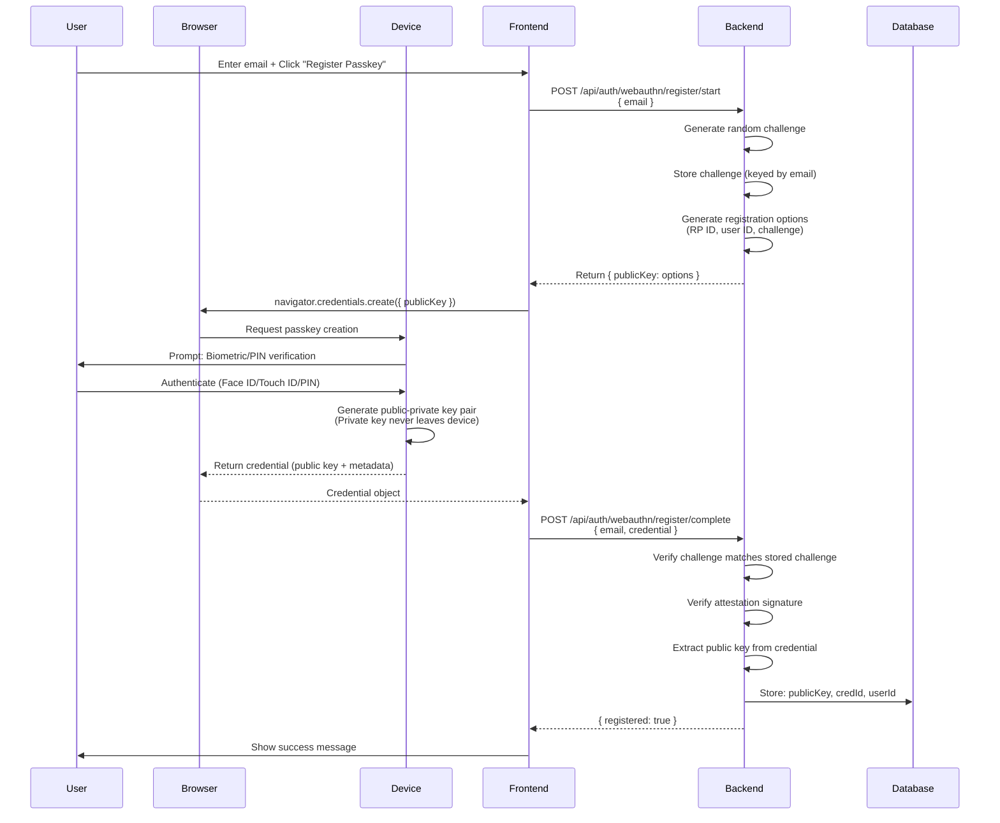
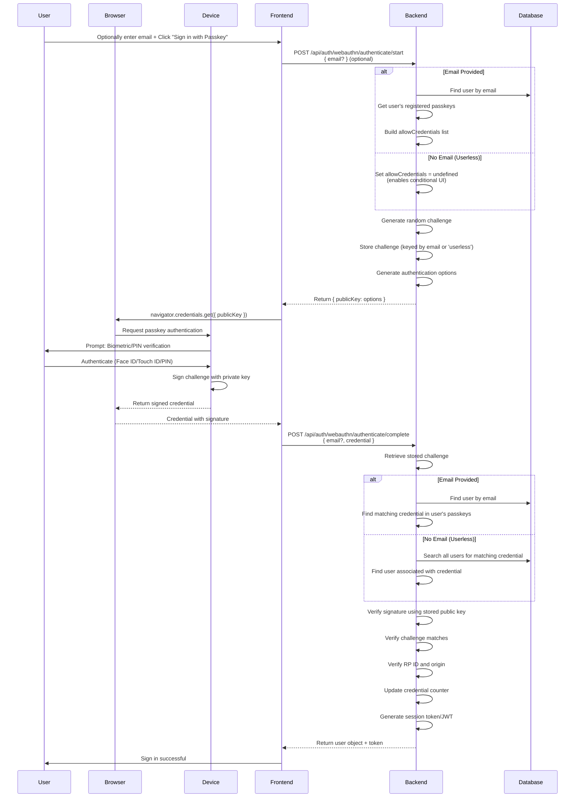
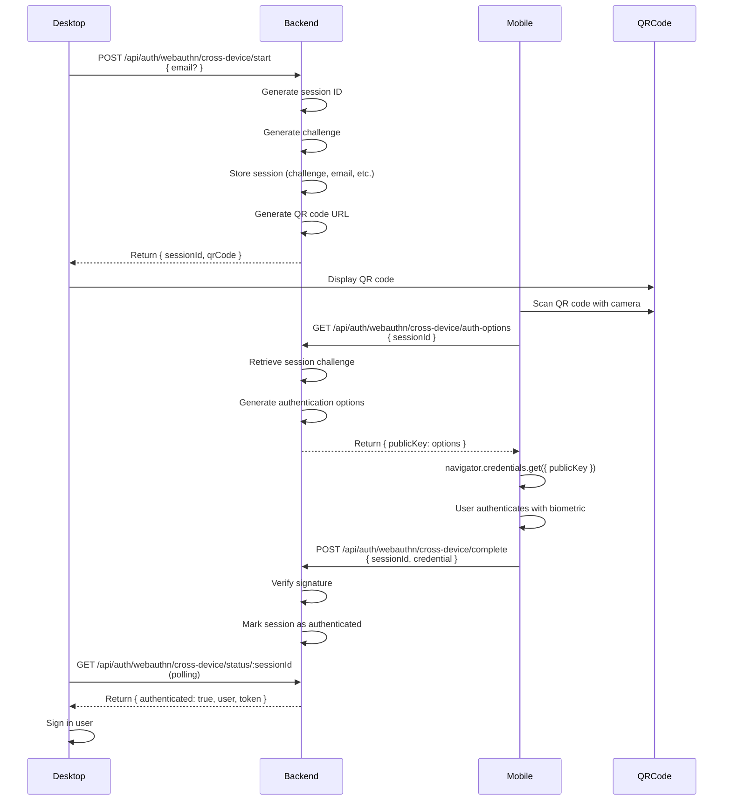

# Passkey Authentication Flow - Technical Documentation

This document describes the complete technical implementation of passkey authentication following FIDO2/WebAuthn standards.

## Overview

The application implements passwordless authentication using **WebAuthn/FIDO2** standards, allowing users to sign in using:
- **Platform authenticators**: Windows Hello, Touch ID, Face ID, or external security keys
- **Cross-device authentication**: Using a phone or tablet to authenticate on a different device
- **Userless authentication**: Sign in without entering email (conditional UI)

## Architecture

### Technology Stack

**Frontend:**
- WebAuthn API (`navigator.credentials`)
- React hooks for WebAuthn operations
- Ant Design UI components

**Backend:**
- `@simplewebauthn/server` library
- Express.js routes
- MongoDB for credential storage
- In-memory challenge storage (development)

**Key Files:**
- Frontend: `web/src/features/authentication/hooks/useWebAuthn.js`
- Frontend: `web/src/features/authentication/components/PasskeySignInOptions.jsx`
- Backend: `backend/src/routes/auth/webauthn.js`
- Service: `web/src/features/authentication/services/webauthnService.js`

---

## 1. Registration Flow (One-Time Setup)

Registration happens when a user creates their first passkey for an account. This is a **one-time process per device**.

### Standard FIDO2 Registration Flow



### Implementation Details

#### Step 1: Registration Start

**Endpoint:** `POST /api/auth/webauthn/register/start`

**Request:**
```json
{
  "email": "user@example.com"
}
```

**Backend Process:**
1. Validates email is provided (required for registration)
2. Finds user by email in database
3. Generates registration options using `generateRegistrationOptions()`:
   - Random cryptographic challenge
   - Relying Party (RP) ID (domain/app ID)
   - User ID (MongoDB `_id` as Uint8Array)
   - User name and display name
   - Exclude existing credentials (prevent duplicates)
4. Stores challenge in memory: `registrationChallenges.set(email.toLowerCase(), challenge)`
5. Returns options to frontend

**Response:**
```json
{
  "publicKey": {
    "challenge": "base64url-encoded-challenge",
    "rp": { "id": "localhost", "name": "Capstone" },
    "user": {
      "id": "base64url-encoded-user-id",
      "name": "user@example.com",
      "displayName": "User Name"
    },
    "pubKeyCredParams": [...],
    "excludeCredentials": [...],
    "timeout": 60000
  }
}
```

**Code Reference:** `backend/src/routes/auth/webauthn.js:68-207`

#### Step 2: Client Creates Passkey

**Frontend Process:**
1. Converts challenge from base64url string to ArrayBuffer
2. Converts user.id from base64url string to ArrayBuffer
3. Calls `navigator.credentials.create({ publicKey })`
4. Browser prompts user for authentication method
5. Device generates key pair (private key stays on device)
6. Returns credential object

**Code Reference:** `web/src/features/authentication/hooks/useWebAuthn.js:35-134`

#### Step 3: Registration Complete

**Endpoint:** `POST /api/auth/webauthn/register/complete`

**Request:**
```json
{
  "email": "user@example.com",
  "credential": {
    "id": "credential-id",
    "rawId": "base64url-encoded-raw-id",
    "type": "public-key",
    "response": {
      "clientDataJSON": "base64url-encoded",
      "attestationObject": "base64url-encoded"
    }
  }
}
```

**Backend Process:**
1. Retrieves stored challenge for email
2. Verifies challenge matches (prevents replay attacks)
3. Calls `verifyRegistrationResponse()` to:
   - Verify attestation signature
   - Extract public key from attestation object
   - Validate RP ID matches
   - Validate origin matches
4. Stores credential in database:
   - `credId`: Base64url-encoded credential ID
   - `publicKey`: Base64-encoded public key (CBOR format)
   - `counter`: Initial counter value (0)
   - `transports`: Array of transport methods
5. Links credential to user account
6. Deletes challenge from memory

**Response:**
```json
{
  "registered": true
}
```

**Code Reference:** `backend/src/routes/auth/webauthn.js:214-496`

### Security Guarantees

- **Phishing-resistant**: Keys are tied to exact domain (RP ID)
- **No password storage**: Only public keys stored, private keys never leave device
- **Replay protection**: One-time challenges prevent replay attacks
- **Device-bound**: Private key stored in secure hardware (TPM/Secure Enclave)

---

## 2. Authentication Flow (Sign-In)

Authentication happens every time a user signs in with their passkey.

### Standard FIDO2 Authentication Flow



### Implementation Details

#### Step 1: Authentication Start

**Endpoint:** `POST /api/auth/webauthn/authenticate/start`

**Request:**
```json
{
  "email": "user@example.com"  // Optional
}
```

**Backend Process:**
1. If email provided:
   - Finds user by email
   - Checks if user has passkeys registered
   - If no passkeys: returns `400 no_passkeys` error
   - Builds `allowCredentials` list from user's registered passkeys
2. If no email provided:
   - Sets `allowCredentials` to `undefined`
   - Enables userless/conditional UI authentication
3. Generates authentication options using `generateAuthenticationOptions()`:
   - Random cryptographic challenge
   - `allowCredentials` (if email provided) or `undefined` (userless)
   - User verification: 'preferred'
   - Timeout: 60 seconds
4. Stores challenge in memory: `authenticationChallenges.set(email || 'userless', challenge)`
5. Returns options to frontend

**Response:**
```json
{
  "publicKey": {
    "challenge": "base64url-encoded-challenge",
    "allowCredentials": [
      {
        "id": "credential-id-1",
        "type": "public-key",
        "transports": ["internal", "usb"]
      }
    ],
    "timeout": 60000,
    "userVerification": "preferred"
  }
}
```

**Code Reference:** `backend/src/routes/auth/webauthn.js:500-563`

#### Step 2: Client Authenticates

**Frontend Process:**
1. Converts challenge from base64url string to ArrayBuffer
2. If `allowCredentials` present, converts each credential ID to ArrayBuffer
3. Calls `navigator.credentials.get({ publicKey })`
4. Browser shows available passkeys (or prompts to select)
5. User authenticates with biometric/PIN
6. Device signs challenge with private key
7. Returns signed credential

**Code Reference:** `web/src/features/authentication/hooks/useWebAuthn.js:136-243`

#### Step 3: Authentication Complete

**Endpoint:** `POST /api/auth/webauthn/authenticate/complete`

**Request:**
```json
{
  "email": "user@example.com",  // Optional
  "credential": {
    "id": "credential-id",
    "rawId": "base64url-encoded-raw-id",
    "type": "public-key",
    "response": {
      "clientDataJSON": "base64url-encoded",
      "authenticatorData": "base64url-encoded",
      "signature": "base64url-encoded",
      "userHandle": "base64url-encoded-user-id"
    }
  }
}
```

**Backend Process:**
1. Retrieves stored challenge (using email or 'userless' key)
2. If email provided:
   - Finds user by email
   - Finds matching credential in user's `webauthnCredentials` array
3. If no email (userless):
   - Searches all users in database
   - Finds user whose credential ID matches
4. Verifies signature using `verifyAuthenticationResponse()`:
   - Verifies challenge matches stored challenge
   - Verifies signature using stored public key
   - Verifies RP ID matches
   - Verifies origin matches
   - Checks credential counter (prevents replay attacks)
5. Updates credential counter in database
6. Generates session token or JWT
7. Returns user object with token

**Response:**
```json
{
  "user": {
    "_id": "...",
    "email": "user@example.com",
    "role": {...}
  },
  "token": "jwt-token-here"
}
```

**Code Reference:** `backend/src/routes/auth/webauthn.js:570-900`

### Userless Authentication (Conditional UI)

When no email is provided:
- Browser shows all available passkeys (from iCloud Keychain, Google Password Manager, etc.)
- User selects which account to sign in with
- Backend searches all users to find matching credential
- This enables "passwordless" sign-in without entering email

**Code Reference:** `backend/src/routes/auth/webauthn.js:644-674`

---

## 3. Cross-Device Authentication Flow

Cross-device authentication allows users to sign in on a desktop using their mobile device.

### Flow Diagram



### Implementation Details

1. **Start Session**: Desktop requests cross-device session, receives QR code
2. **Scan QR Code**: Mobile device scans QR code, opens authentication page
3. **Mobile Authentication**: Mobile device authenticates using passkey
4. **Polling**: Desktop polls for authentication status
5. **Complete**: When authenticated, desktop receives user + token

**Code Reference:** `backend/src/routes/auth/webauthn.js:1300-2100`

---

## 4. Security Guarantees

| Feature | How Passkeys Achieve It | Implementation |
|---------|------------------------|----------------|
| **Phishing-resistant** | Keys tied to exact domain (RP ID) | RP ID validation in `verifyRegistrationResponse` and `verifyAuthenticationResponse` |
| **No password leaks** | No password stored or transmitted | Only public keys stored in database |
| **MFA by default** | Biometric + device possession | Requires biometric/PIN + device with private key |
| **Replay protection** | One-time cryptographic challenges | Challenge stored temporarily, verified, then deleted |
| **Device-bound** | Private key never leaves hardware | Private key stored in TPM/Secure Enclave, never transmitted |
| **Counter protection** | Credential counter prevents cloning | Counter incremented on each use, verified on authentication |

### Challenge Storage

**Current Implementation:**
- Challenges stored in memory (`Map` objects)
- Keyed by email (registration/authentication) or 'userless' (userless auth)
- Automatically cleaned up after use

**Production Considerations:**
- For clustered deployments, use Redis or database for challenge storage
- Set appropriate TTL (time-to-live) for challenges (e.g., 5 minutes)
- Implement cleanup job for expired challenges

**Code Reference:** `backend/src/routes/auth/webauthn.js:43-45`

---

## 5. Error Handling

### Registration Errors

| Error Code | Scenario | User Action |
|------------|----------|-------------|
| `email_required` | Email not provided | Enter email address |
| `user_not_found` | Email doesn't match any account | Sign up first or check email |
| `webauthn_register_start_failed` | Server error generating options | Retry or contact support |
| `webauthn_register_complete_failed` | Verification failed | Re-register passkey |

### Authentication Errors

| Error Code | Scenario | User Action |
|------------|----------|-------------|
| `no_passkeys` | User has no passkeys registered | Register a passkey first |
| `credential_not_found` | Passkey not found for account | Use different passkey or register new one |
| `challenge_missing` | Challenge expired or not found | Retry authentication |
| `user_not_found` | Email doesn't match any account | Check email or sign up |
| `webauthn_auth_failed` | Signature verification failed | Retry or contact support |

### Frontend Error Handling

The frontend automatically detects `no_passkeys` errors and shows a "Register Passkey" option instead of an error message.

**Code Reference:** `web/src/features/authentication/components/PasskeySignInOptions.jsx:197-243`

---

## 6. Implementation Stack

### Backend

- **Framework**: Express.js
- **Library**: `@simplewebauthn/server` (v13+)
- **Database**: MongoDB (Mongoose)
- **Validation**: Joi schemas
- **Challenge Storage**: In-memory Map (development)

### Frontend

- **Framework**: React
- **API**: WebAuthn API (`navigator.credentials`)
- **Library**: Custom hooks wrapping WebAuthn API
- **UI**: Ant Design components
- **State Management**: React hooks

### Endpoints

**Registration:**
- `POST /api/auth/webauthn/register/start` - Start registration
- `POST /api/auth/webauthn/register/complete` - Complete registration

**Authentication:**
- `POST /api/auth/webauthn/authenticate/start` - Start authentication
- `POST /api/auth/webauthn/authenticate/complete` - Complete authentication

**Cross-Device:**
- `POST /api/auth/webauthn/cross-device/start` - Start cross-device session
- `GET /api/auth/webauthn/cross-device/status/:sessionId` - Check status
- `POST /api/auth/webauthn/cross-device/auth-options` - Get auth options for mobile
- `POST /api/auth/webauthn/cross-device/complete` - Complete mobile authentication

**Credential Management:**
- `GET /api/auth/webauthn/credentials` - List user's passkeys
- `DELETE /api/auth/webauthn/credentials/:credId` - Delete specific passkey
- `DELETE /api/auth/webauthn/credentials` - Delete all passkeys

---

## 7. Code References

### Backend Files

- **Main Routes**: `backend/src/routes/auth/webauthn.js`
  - Registration start: Lines 68-207
  - Registration complete: Lines 214-496
  - Authentication start: Lines 500-563
  - Authentication complete: Lines 570-900
  - Cross-device: Lines 1300-2100

### Frontend Files

- **WebAuthn Hook**: `web/src/features/authentication/hooks/useWebAuthn.js`
  - Registration: Lines 35-134
  - Authentication: Lines 136-243
  - Platform authenticator: Lines 245-254

- **UI Component**: `web/src/features/authentication/components/PasskeySignInOptions.jsx`
  - Passkey detection: Lines 26-103
  - Authentication handler: Lines 130-224
  - Registration handler: Lines 226-301

- **Service Layer**: `web/src/features/authentication/services/webauthnService.js`
  - API calls to backend endpoints

---

## 8. Deviations from Standard Flow

### Email Requirement for Registration

**FIDO2 Standard**: Email/username is typically required for registration to link passkey to account.

**Implementation**: ✅ **Matches standard** - email is required for registration.

**Rationale**: Registration must link the passkey to a specific user account. Without email, we cannot determine which account to associate the passkey with.

**Code Reference**: `backend/src/routes/auth/webauthn.js:75-77`

### Optional Email for Authentication

**FIDO2 Standard**: FIDO2 supports userless authentication (conditional UI) where no email is required.

**Implementation**: ✅ **Matches standard** - email is optional for authentication, enabling userless auth.

**Rationale**: Userless authentication allows users to sign in without entering email, improving UX. The browser shows all available passkeys, and the backend searches all users to find the matching credential.

**Code Reference**: `backend/src/routes/auth/webauthn.js:507-532` (email optional), `644-674` (userless search)

### Challenge Storage

**FIDO2 Standard**: Challenges should be stored securely and have expiration to prevent replay attacks.

**Implementation**: ⚠️ **Deviation** - Currently stored in-memory (development). Should use Redis/database for production.

**Current Implementation**:
- Challenges stored in `Map` objects in memory
- Keyed by email (registration/authentication) or 'userless' (userless auth)
- Automatically cleaned up after use
- No expiration timeout (relies on cleanup after verification)

**Production Recommendation**:
- Use Redis with TTL (time-to-live) of 5 minutes
- Or use database with expiration timestamps
- Implement cleanup job for expired challenges
- This is critical for clustered/horizontal scaling deployments

**Code Reference**: `backend/src/routes/auth/webauthn.js:43-45` (challenge storage)

### Multiple Passkeys per User

**FIDO2 Standard**: Users can register multiple passkeys for the same account (one per device).

**Implementation**: ✅ **Matches standard** - users can register multiple passkeys (one per device).

**Rationale**: Multiple passkeys provide backup options and allow users to use different devices. The `excludeCredentials` parameter prevents duplicate registration of the same credential.

**Code Reference**: `backend/src/routes/auth/webauthn.js:94-107` (excludeCredentials)

### Credential Counter

**FIDO2 Standard**: Credentials should maintain a counter that increments on each use to prevent cloning attacks.

**Implementation**: ✅ **Matches standard** - counter is stored and verified.

**Current Implementation**:
- Counter stored in database with each credential
- Counter verified during authentication
- Counter updated after successful authentication
- Initial counter value is 0

**Code Reference**: `backend/src/routes/auth/webauthn.js:696-723` (counter handling)

### RP ID Validation

**FIDO2 Standard**: RP ID (Relying Party ID) must match the domain where the passkey was registered.

**Implementation**: ✅ **Matches standard** - RP ID is validated during both registration and authentication.

**Current Implementation**:
- RP ID set via `WEBAUTHN_RPID` environment variable (defaults to 'localhost' for development)
- RP ID validated in `verifyRegistrationResponse` and `verifyAuthenticationResponse`
- Origin also validated to match frontend URL

**Code Reference**: `backend/src/routes/auth/webauthn.js:91` (RP ID), `703-704` (origin/RP ID validation)

### Attestation Type

**FIDO2 Standard**: Attestation can be 'none', 'direct', or 'indirect' depending on security requirements.

**Implementation**: ✅ **Matches standard** - uses 'none' attestation type.

**Rationale**: 'none' attestation is sufficient for most use cases and provides better privacy (doesn't reveal device manufacturer). For higher security requirements, 'direct' or 'indirect' can be used.

**Code Reference**: `backend/src/routes/auth/webauthn.js:119` (attestationType: 'none')

### User Verification

**FIDO2 Standard**: User verification can be 'required', 'preferred', or 'discouraged'.

**Implementation**: ✅ **Matches standard** - uses 'preferred' user verification.

**Rationale**: 'preferred' allows the authenticator to use user verification (biometric/PIN) when available, but doesn't fail if it's not available. This provides good security while maintaining compatibility.

**Code Reference**: `backend/src/routes/auth/webauthn.js:122` (userVerification: 'preferred'), `537` (authentication)

### Summary of Compliance

| Feature | FIDO2 Standard | Implementation | Status |
|---------|---------------|----------------|--------|
| Email for registration | Required | Required | ✅ Compliant |
| Email for authentication | Optional | Optional | ✅ Compliant |
| Challenge storage | Secure with expiration | In-memory (dev) | ⚠️ Needs production fix |
| Multiple passkeys | Supported | Supported | ✅ Compliant |
| Credential counter | Required | Implemented | ✅ Compliant |
| RP ID validation | Required | Implemented | ✅ Compliant |
| Attestation | Configurable | 'none' | ✅ Compliant |
| User verification | Configurable | 'preferred' | ✅ Compliant |

---

## 9. Best Practices

1. **Always verify challenges**: Never skip challenge verification
2. **Validate RP ID**: Ensure RP ID matches your domain
3. **Check origin**: Verify origin matches expected frontend URL
4. **Update counters**: Always update and verify credential counters
5. **Handle errors gracefully**: Show user-friendly error messages
6. **Support multiple passkeys**: Allow users to register multiple devices
7. **Provide fallback**: Always allow password-based login as fallback

---

## 10. Testing

### Manual Testing Checklist

- [ ] Register passkey with email
- [ ] Authenticate with email
- [ ] Authenticate without email (userless)
- [ ] Register multiple passkeys for same account
- [ ] Delete passkey
- [ ] Cross-device authentication
- [ ] Error handling (no passkeys, wrong credential, etc.)

### Test Scenarios

1. **New User Registration**: User with no passkeys tries to authenticate → should show registration option
2. **Userless Auth**: User authenticates without email → should search all users
3. **Wrong Credential**: User uses passkey from different account → should show error
4. **Expired Challenge**: User waits too long → should show challenge_missing error

---

## References

- [WebAuthn Specification (W3C)](https://www.w3.org/TR/webauthn-2/)
- [FIDO2 Documentation](https://fidoalliance.org/fido2/)
- [SimpleWebAuthn Documentation](https://simplewebauthn.dev/)
- [Passkeys.dev](https://passkeys.dev/) - Comprehensive passkey resources
